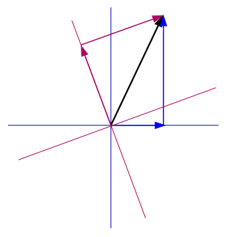

---
jupytext:
  text_representation:
    extension: .md
    format_name: myst
    format_version: 0.13
    jupytext_version: 1.15.2
kernelspec:
  display_name: Python 3 (ipykernel)
  language: python
  name: python3
---

+++ {"slideshow": {"slide_type": "slide"}}

# 1.2 Los Vectores

$ \newcommand{\bra}[1]{\langle #1|} $
$ \newcommand{\ket}[1]{|#1\rangle} $
$ \newcommand{\braket}[2]{\langle #1|#2\rangle} $
$ \newcommand{\i}{{\color{blue} i}} $ 
$ \newcommand{\Hil}{{\cal H}} $
$ \newcommand{\Lin}{\hbox{Lin}} $
$ \newcommand{\R}{{\mathbb R}} $
$ \newcommand{\C}{{\mathbb C}} $
$ \newcommand{\V}{{ V}} $

+++ {"slideshow": {"slide_type": "skip"}}

- [Espacio Vectorial Complejo](#vecdefi) 

- [Bases](#Bases)

-  [Espacio de Hilbert](#vecprodesc)   

```{code-cell} ipython3
---
slideshow:
  slide_type: '-'
---
import sys
sys.path.append('../')
import macro_tQ as tQ

import numpy as np
import scipy.linalg as la
from IPython.display import display,Markdown,Latex
import matplotlib.pyplot as plt
from qiskit.tools.visualization import array_to_latex
import copy 
```

El objeto matemático que codifica la máxima información obtenible de un sistema es un vector. Comenzaremos definiendo los vectores de una forma operativa, y después haremos hincapié en su carácter abstracto.

+++ {"slideshow": {"slide_type": "skip"}}

#### Definición

La forma operacional de definir  un *vector de dimensión* $N$ consiste en lista (columna) de $N$ números complejos 
<br>
<br>
$$
|u\rangle = \begin{pmatrix} {u_1}\\ {u_2}\\ \vdots \\ {u_N} 
\end{pmatrix}
$$

+++ {"slideshow": {"slide_type": "skip"}}

- El símbolo $\ket{u}$  *representa* al vector y se denomina **ket** en la *notación de Dirac* 

- Los números complejos $u_i \in {\mathbb C}$ con $\, i=1,...,N$ se denominan **componentes** del vector $\ket{u}$ (en una base dada).

+++ {"slideshow": {"slide_type": "skip"}}

## 1.2.1 Espacio Vectorial 

+++ {"slideshow": {"slide_type": "skip"}}

<div class="alert alert-block alert-info",text-align:center>
<p style="text-align: center;"> <p style="text-align: left ;color: navy;">  
    <b> Definición: </b> <i> (Espacio Vectorial)</i>
<br>    
    la colección de <i>todos los posibles vectores</i> de $N$ componentes,  con las  propiedades de suma y multiplicación forman un <b>espacio vectorial</b>, $\V$ de dimension compleja $N$
<br>    
</div>

+++ {"slideshow": {"slide_type": "skip"}}

es decir,  en un espacio vectorial  tenemos dos operaciones posibles: 

- sumar dos vectores  
$$
 |u\rangle + \ket{v}~ =~\, 
\begin{pmatrix} {u_1}+v_1\\ {u_2}+v_2\\ \vdots \\ {u_N}+v_n \end{pmatrix} ~= ~\ket{w}
$$
- multiplicar un vector por número complejo $\lambda\in {\mathbb C}$
<br>
<br>

$$
 \lambda|u\rangle ~ =~   \begin{pmatrix} {\lambda u_1}\\ {\lambda u_2}\\ \vdots \\ {\lambda u_N} \end{pmatrix} ~\equiv~\ket{\lambda u}
$$

```{code-cell} ipython3
---
slideshow:
  slide_type: skip
---
' qiskit tiene un visualizador de matrices bastante nítido'
from qiskit.tools.visualization import array_to_latex

uket=np.array([[1 + 1.j],[2-3*1.j]])
 
display(array_to_latex(uket))
```

+++ {"slideshow": {"slide_type": "skip"}}

- todo vector de $V$ se denota mediante el símbolo $\ket{v}$ menos uno, el **elemento neutro** que se escribe como $0$.
<br>
<br>
- La existencia de un **elemento opuesto** y de un elemento neutro son dos propiedades que definen un espacio vectorial

\begin{eqnarray}
\ket{v} + 0 &=& \ket{v} \nonumber\\
\ket{v} + \ket{\hbox{-}v} &=& \ket{v}-\ket{v} = 0 \nonumber\\
\end{eqnarray}

+++ {"slideshow": {"slide_type": "skip"}}

<div class="alert alert-block alert-danger">
<b>Notar</b>:     

La <b>dimensión</b> es igual al número de cantidades (<i>grados de libertad</i>) que debemos fijar para especificar un vector. 

<br>
    
Pero $N$ números complejos equivalen a $2N$ números reales. 

<br>
   
Entonces, podemos decir que:  
la <i>dimensión compleja</i> de un espacio vectorial complejo  $\V$ es $N$, o que su <i>dimensión real</i> es $2N$ 
<br>
<br>
$$
{\rm dim}_{\mathbb C} \V = N ~~~~\Longleftrightarrow ~~~   {\rm dim}_{\mathbb R} \V = 2N 
$$
</div>

+++ {"slideshow": {"slide_type": "slide"}}

## 1.2.2 Base 

+++ {"slideshow": {"slide_type": "-"}}

<div class="alert alert-block alert-info",text-align:center>
<p style="text-align: center;"> <p style="text-align: left ;color: navy;">  
<b> Definición: </b> 
$~$   
en un espacio vectorial $V$ de dimensión $N$ una <b>base</b> es una colección $\{\ket{e_1},...,\ket{e_N}\}$ de $N$ vectores  <i>linealmente independientes</i>
</div>    


+++

 Cualquier vector $\ket{v}\in V$ que no sea el elemento neutro $\ket{v}\neq 0$,  se puede expresar como una <i>combinación lineal</i> de  los vectores de una base
<br>
<br>
$$
\ket{v} = \sum_{i=1}^N v_i \ket{e_i} ~=~ v_1\ket{e_1} \,+\, v_2\ket{e_2}\, +\, ...\, +\, v_N \ket{e_N}
$$  
<br>
Los coeficientes $v_i$ son las **componentes** de $\ket{v}$ **en la base dada** $ \{ \ket{e_i} \}$.

+++

Existen infinitas bases y esto es una propiedad *muy importante* de los espacios vectoriales. Trataremos el cambio de base más adelante. 

+++ {"slideshow": {"slide_type": "skip"}}

Si trabajamos en una base $\{ e_i\}$ las componentes de los propios vectores de la base son 1 ó 0

<br>

$$
|e_1\rangle \sim \begin{pmatrix} 1 \\ 0 \\ 0\\ \vdots 
\\ 0 \\ 0 \end{pmatrix}~~~~
~~~|e_2\rangle \sim \begin{pmatrix} 0 \\ 1 \\ 0\\ \vdots 
\\ 0 \\ 0 \end{pmatrix}~~~~~~~~~
\cdots ~~~~~~~~
~~|e_{N-1}\rangle \sim \begin{pmatrix} 0 \\ 0 \\ 0\\\vdots 
\\ 1 \\ 0 \end{pmatrix}~~~~
~~|e_N\rangle \sim \begin{pmatrix} 0 \\ 0 \\0\\ \vdots 
\\ 0 \\ 1 \end{pmatrix}
$$
<br>


<hr />

+++ {"slideshow": {"slide_type": "skip"}}

Cualquier vector, escrito como una combinación lineal de sus elementos adquiere la representación que hemos utilizado para definir los vectores
<br>

$$
|u\rangle ~=~ {u_1} |e_1 \rangle + {u_2} | e_2\rangle +... + {u_{ N}}|e_{ N}\rangle~=~ \sum_{i=1}^N {u_ i} |e_i\rangle \, =
$$

<br>

$$
=~ {u_1} \begin{pmatrix} 1 \\ 0 \\ 0\\ \vdots 
\\ 0 \\ 0 \end{pmatrix} \,+\,{u_2} \begin{pmatrix} 0 \\ 1 \\ 0\\ \vdots \\ 0 \\ 0 \end{pmatrix}~+~ ... ~+ ~
{u_{N-1}} \begin{pmatrix} 0 \\ 0 \\ 0\\\vdots 
\\ 1 \\ 0 \end{pmatrix}+ 
\,{u_N}\,  \begin{pmatrix} 0 \\ 0 \\0\\ \vdots 
\\ 0 \\ 1 \end{pmatrix}~~~= ~~~
  \begin{pmatrix} {u_1} \\ {u_2} \\{u_3}\\ \vdots 
\\ \,{u_{N-1}}\, \\ {u_{N}} \end{pmatrix}
$$

<br>

+++ {"slideshow": {"slide_type": "skip"}}

Podemos usar la clase **Statevector** de *qiskit* para tener una expansión en la base $\{\ket{e_i}=\ket{b(i)}\}$, donde $b(i)$ es la representación binaria del índice $i$. Por ejemplo $b(3) = 11$.

```{code-cell} ipython3
---
slideshow:
  slide_type: skip
---
from qiskit.quantum_info import Statevector
uket=np.array([[ 1.+1.j], [ 2.-3.j],[ 2.+2.j],[-1.-1.j]])
display(array_to_latex(uket))

Statevector(uket).draw('latex')
```

+++ {"slideshow": {"slide_type": "slide"}}

### Cambio de base

Como hemos adelantado, existen *infinitas* bases  en un espacio vectorial de dimensión finita.
Todas ellas sirven para representar un vector arbitrario.

Consideremos dos bases 
$\{\ket{e_i}\}$ y $\{\ket{\tilde e_j}\}$ donde $ i,j = 1,...,N$:

+++ {"slideshow": {"slide_type": "fragment"}}

cualquier *elemento* (vector) <u>de una base</u> se puede expresar como una *combinación lineal de elementos*  <u>de la otra</u> 

$$
\ket{\tilde e_j} = \sum_{i=1}^N C_{ i j} \ket{e_i} ~~~~~~~j=1,..., N
$$


Los coefficientes  $C_{ i j}\in {\mathbb C}$ constituyen la *matriz* $C_{ij}$ de *cambio de base*


+++ {"slideshow": {"slide_type": "skip"}}

<div class="alert alert-block alert-warning">
<b>Ejemplo</b>: sea una nueva base $\{\ket{f_1},\ket{f_2}\}$ definida en términos de la antigua mediante 

$$\ket{f_1} = \frac{1}{\sqrt{2}}\left(\rule{0mm}{4mm}\ket{e_1} + i\ket{e_2}\right)~,~~\ket{f_2} = \frac{1}{\sqrt{2}}\left( \rule{0mm}{4mm}\ket{e_1} - i\ket{e_2}\right)\, .
$$

La matriz de coeficientes es 

$$
C_{ij} = \frac{1}{\sqrt{2}}\begin{bmatrix} 1 & 1 \\ i & -i \end{bmatrix}\, ,
$$

El cambio de base, usando esta matriz se escribe de forma matricial

$$
(\ket{f_1},\ket{f_2}) = (\ket{e_1},\ket{e_2}) \cdot \frac{1}{\sqrt{2}}\begin{bmatrix} 1 & 1 \\ i & -i \end{bmatrix}
$$

+++ {"slideshow": {"slide_type": "skip"}}

<div class="alert alert-block alert-danger">
    <b>Notar</b>: la forma en que están sumados los índices 
<br>
$$\ket{\tilde e_j} = \sum_{\color{blue}{i=1}}^{\color{blue}{N}} C_{ \color{blue}{i} j} \ket{e_\color{blue}{i}}$$
<br>
Esto hace que, si queremos escribir esta ecuación en notación matricial,  debamos poner los vectores en una fila
    
$$
\begin{pmatrix} \ket{\tilde e_1} & \cdots & \ket{\tilde e_N} \end{pmatrix} = 
\begin{pmatrix} \ket{ e_\color{blue}{1}} & \cdots & \ket{e_\color{blue}{N}}\end{pmatrix}
\begin{pmatrix} C_{\color{blue}{1}1} & \cdots & C_{\color{blue}{1}N} \\ \vdots & \ddots & \vdots \\ C_{\color{blue}{N}1} & \cdots & C_{\color{blue}{N}N} \end{pmatrix}
$$
<br>
</div>

+++

Un vector es un objeto abstracto, un elemento de un espacio vectorial. La definición que dimos al principio es fácil de entender, pero conlleva la elección implícita de una base. En cada base un vector se representa con un conjunto de componentes diferentes

+++ {"slideshow": {"slide_type": "slide"}}

Un vector puede ser expandido en ambas bases 

$$~~\ket{v}  = \sum_{i} v_i \color{blue}{\ket{e_i}} = \sum_j \tilde v_j \color{magenta}{\ket{\tilde e_j}}$$

<br>
<br>
<div>

</div>
<br>
<br>

+++ {"slideshow": {"slide_type": "slide"}}

La relación entre los coeficientes se sigue de la misma matriz de cambio de base
<br>
<br>

\begin{eqnarray}
\ket{v}  ~= ~ \sum_{i} v_i \ket{e_i} &~=~& \sum_j \tilde v_j \ket{\tilde e_j} \nonumber\\
&~=~&  \sum_j \tilde v_j \left( \sum_{i} C_{ij} \ket{e_i}\right) \nonumber \\
&~=~&  \sum_{j}\sum_{i} \tilde v_j   C_{ij} \ket{e_i} \nonumber \\
&~=~& \sum_i \left( \sum_j C_{ij} \tilde v_j \right) \ket{e_i}  \nonumber \\
\end{eqnarray}

+++ {"slideshow": {"slide_type": "slide"}}

Comparando obtenemos la relación de coeficientes 

$$
v_i = \sum_{j} C_{i\color{black}{j}} \tilde v_{\color{black}{j}}
$$


+++ {"slideshow": {"slide_type": "skip"}}

que podemos invertir 

$$
\tilde v_i = \sum_{j} C^{-1}_{i\color{black}{j}} v_{\color{black}{j}}
$$

+++ {"slideshow": {"slide_type": "skip"}}

<div class="alert alert-block alert-danger">
    <b>Notar</b>:
    
1. la forma en que están sumados los índices hace que, en notación matricial esta operación se represente como sigue

$$
\begin{pmatrix} v_1\\ \vdots \\ v_n\end{pmatrix} = 
\begin{pmatrix} C_{11} & \cdots & C_{1n} \\ \vdots & \ddots & \vdots \\ C_{n1} & \cdots & C_{nn} \end{pmatrix}
\begin{pmatrix} \tilde v_1\\ \vdots \\ \tilde v_n\end{pmatrix}
$$
   
<br>    
    
2.  la misma matriz $C$, que lleva $\ket{e_i} \to \ket{\tilde e_i}$, lleva $\tilde v_j \to v_j$
</div>

+++ {"slideshow": {"slide_type": "skip"}}

En particular esto dice que la matriz $C_{ij}$ se lee inmediatamente de expresar la nueva base en la antigua

+++ {"slideshow": {"slide_type": "skip"}}

<div class="alert alert-block alert-warning">
<b>Ejemplo</b>: (continuación)
    
$$
\ket{\tilde e_1} \sim \frac{1}{\sqrt{2}}\begin{bmatrix} 1 \\i \end{bmatrix}~~~,~~~~
\ket{\tilde e_2} \sim \frac{1}{\sqrt{2}}\begin{bmatrix} 1 \\-i \end{bmatrix}~~.
$$
<br>
    
Poniendo las dos columnas en una sola matriz, obtenemos  la matriz $C_{ij}$ que efectúa el cambio de los vectores de la base
<br>
<br>
    
$$
 \frac{1}{\sqrt{2}}\begin{bmatrix} 1 \\i \end{bmatrix} = \frac{1}{\sqrt{2}}\begin{bmatrix} 1 & 1 \\ i & -i \end{bmatrix}\begin{bmatrix} 1 \\0 \end{bmatrix}~~~~~,~~~~~~~
\frac{1}{\sqrt{2}}\begin{bmatrix} 1 \\-i \end{bmatrix} = \frac{1}{\sqrt{2}}\begin{bmatrix} 1 & 1 \\ i & -i \end{bmatrix}\begin{bmatrix} 0 \\1 \end{bmatrix}~~~~~.~~~~~~~
$$
</div>

+++ {"slideshow": {"slide_type": "skip"}}

<div class="alert alert-block alert-success">
<b>Ejercicio:</b>$~$
<br>
considera las bases ortonormales $\{\ket{0},\ket{1}\}$ y $\{\ket{+},\ket{-}\}$ donde $\ket{\pm} = \frac{1}{\sqrt{2}}(\ket{0} \pm \ket{1})$. 
<br>
Las componentes del vector $\ket{u} \sim \begin{pmatrix}3\\1\end{pmatrix}$ están escritas en la primera base. 
<br>
<br>
Halla las componentes de $\ket{u}$ en la segunda.
</div>

+++

## 1.2.2 Subespacios Vectoriales

+++

Seal $B = \{\ket{e_i}\}_{i=1,...,N}$ la base  de un espacio vectorial $V$. Cualquier subconjunto de elementos de dicha base, $\bar B\subset B$, genera un *subespacio vectorial* $\bar V \subset V$


+++

### Suma Directa

Por ejemplo, podemos dividir $B$ en dos subconjuntos complementarios

$$B_1 =  \{\ket{e_i}\}_{i=1,...,N_1}~~~~~~~,~~~~~~~~~  B_2 =  \{\ket{e_i}\}_{i={N_1}+1,...,N}$$

de forma que $B = B_1 \cup B_2$

+++

Cada subconjunto será base de un subespacio vectorial $B_1 \to V_1$ y $B_2\to V_2$ de forma que el espacio original será la **suma directa** de ambos

$$
V  = V_1  + V_2
$$


+++

Cualquier vector $\ket{u}\in V$ se escribirá en la forma $\ket{v} = \ket{v_1} + \ket{v_2}$ de vectores pertenecientes a cada subespacio.

+++

Por construcción, la dimensión de una suma directa es la suma de las dimensiones $\hbox{dim}\, V = \hbox{dim}\, V_1 + \hbox{dim}\, V_2$

+++ {"slideshow": {"slide_type": "slide"}}

## 1.2.2 Espacio de Hilbert

+++ {"slideshow": {"slide_type": "skip"}}

###  Conjugación adjunta

La operación *conjugación adjunta*,  $\dagger$, es una *extensión* de la *conjugación compleja* de ${\mathbb C}$ a todos los elementos  de $\Hil$

+++ {"slideshow": {"slide_type": "skip"}}

Asociado a cada *ket* $\ket{u}$, definimos un vector **adjunto**, o *bra* $\bra{u}\equiv\left(\ket{u}\right)^\dagger$,  que representamos mediante un vector fila con las componentes conjugadas complejas.  
<br>
<br>
$$
\dagger \,: \quad\,|u\rangle = \begin{pmatrix} {u_1}\\ {u_2}\\ \vdots \\ {u_N} 
\end{pmatrix} ~~~~~{\rightarrow}~~~~~~ \left(\ket{u}\right)^\dagger \equiv \bra{u} =\begin{pmatrix} {u_1^*} & {u_2^*} & \cdots & {u_N^*}
\end{pmatrix}
$$

<hr />

+++ {"slideshow": {"slide_type": "skip"}}

Consistentemente encontramos para el producto de un vector por un número complejo $\lambda$

$$
\dagger \,:\quad\,  \lambda\ket{u}=\ket{\lambda u} ~~~~~{\rightarrow}~~~~~~ \left(\lambda\ket{u}\right)^\dagger=\lambda^*\bra{u} = \bra{u}\lambda^* = \bra{\lambda u}
$$

ya que el producto de un vector por un número es conmutativo.

+++ {"slideshow": {"slide_type": "skip"}}

Al igual que la conjugación compleja, la conjugación adjunta es una *involución*: su aplicación sucesiva devuelve el vector original

$$
(\ket{u}^\dagger)^\dagger =\bra{u}^\dagger =  \ket{u}
$$

es decir, $\dagger^2 = I$, el operador identidad.

```{code-cell} ipython3
---
slideshow:
  slide_type: skip
---

'definamos un ket'
uket=np.array([[1+1j],[2-3*1.j]])
display(array_to_latex(uket))
#print(uket.shape)

'el bra asociado será una fila formada por las componentes conjugadas complejas'
ubra=uket.conj().T

display(array_to_latex(ubra))
#print(ubra.shape)
```

+++ {"slideshow": {"slide_type": "fragment"}}

<div class="alert alert-block alert-info",text-align:center>
<p style="text-align: center;"> <p style="text-align: left ;color: navy;">  
<b> Definición: </b> 
<br>
Un <i> espacio de Hilbert</i>,  ${\Hil}$, es un espacio vectorial
dotado de una operación interna   denominada <i>producto escalar</i>.
</div>

+++ {"slideshow": {"slide_type": "slide"}}

### Producto Escalar
<div class="alert alert-block alert-info",text-align:center>
<p style="text-align: center;"> <p style="text-align: left ;color: navy;">  
<b> Definición: </b> 
$~$ el <i>producto escalar</i> de dos vectores $\ket{u}$ y $\ket{v}$ es un <i>número complejo</i> 
$a\in{\mathbb C}$    
que denotamos <i>braket</i>
<br>
<br>
$$a \equiv \braket{u}{v} $$
<br>
si verifica las dos propiedades siguiente
<br>
<br>
- linealidad: $\to \bra{u}\big(\ket{v}+\ket{w}\big) = \braket{u}{v} + \braket{u}{w}$
<br>
<br>
- hermiticidad: $\to \braket{v}{u} = \braket{u}{v}^*$
<br>
<br>
- positividad: $\braket{u}{u} >0$ para todo ket $\ket{u}\neq 0$
<br>
<br>
- no-degeneración: $~$ si  $\braket{u}{v} = 0$ para todo $\bra{u}$, entonces necesariamente $\ket{v}=0$

</div>

+++ {"slideshow": {"slide_type": "slide"}}

Combinando ambas propiedades, el producto escalar también es lineal en el primer argumento

$$(\bra{u}+\bra{w})\ket{v} = \braket{u}{v} + \braket{w}{v}$$

+++ {"slideshow": {"slide_type": "skip"}}

Notar que la propiedad de hermiticidad es precisamente la extensión de la conjugación compleja de la que hablábamos al definir la aplicación *adjunta*

$$
\braket{u}{v}^* = \braket{u}{v}^\dagger  = \braket{v}{u}
$$

Hemos usado que $\bra{u}^\dagger = \ket{u}$ y  $\ket{v}^\dagger = \bra{v}$ pero le hemos añadido una regla más: 
<u>*al tomar el mapa adjunto es necesario invertir el orden de los elementos*</u>
 
 De no haber seguido esta regla, habríamos obtenido un resultado **erróneo**
 
 $$
\braket{u}{v}^\dagger \to \ket{u}\bra{v} 
 $$
 
que no es ni siguiera un número complejo. 

+++ {"slideshow": {"slide_type": "slide"}}

### Norma

Una **norma** es un una función real $\|\cdot\| : \Lin(\Hil) \to {\mathbb R}$ con las siguientes propiedades 


- ser definida positiva $\|A\|\geq 0$ con $\| A\| = 0 \Leftrightarrow A= 0$
<br>

- homogeneidad $\|\lambda A\| = |\lambda| \|A\|$ 
<br>

- triangle inequality. $\|A+B\| \leq \| A\| + \|B\|$

+++ {"slideshow": {"slide_type": "slide"}}

Un espacio de Hilbert es, automáticamente un espacio normado. 
La positividad  del producto escalar de un vector por sí mismo  permite definir su *norma*.

<br>

$$
\|\ket{v}\| = \sqrt{\braket{v}{v}} 
$$
<br>

+++ {"slideshow": {"slide_type": "skip"}}

<div class="alert alert-block alert-danger">
    <b>Notar</b>:

- en contraste con la definición de producto escalar en espacios vectoriales reales, en el caso complejo se hace necesario conjugar el <i>bra</i>, para  que la <i>norma</i> de un vector sea siempre real y positiva. Esta es la idea detrás de la definición de la <i>conjugación adjunta</i>.


- el único vector que tiene norma nula en un espacio de Hilbert es el elemento neutro
$$
\braket{v}{v} = 0 ~~~ \Leftrightarrow ~~~\ket{v} = 0
$$
  
</div>

+++ {"slideshow": {"slide_type": "fragment"}}

### Distancia

+++ {"slideshow": {"slide_type": "-"}}

Dados dos elementos $\ket{u}$ y $\ket{v}$ de $\Hil$, podemos definir la *distancia* entre ellos como la *norma de su diferencia* 
<br>
<br>
$$
d(\rule{0mm}{5mm}\ket{v},\ket{w}) = \| \ket{v}-\ket{w}\|
$$

+++ {"slideshow": {"slide_type": "skip"}}

En particular 

-  $d(\ket{v}, \ket{w}) = d(\ket{w}, \ket{v})$ 

<br>

- $d(\ket{v}, \ket{v}) = 0$

+++ {"slideshow": {"slide_type": "slide"}}

## 1.2.3 Bases ortonormales

+++ {"slideshow": {"slide_type": "skip"}}

Hasta ahora, a los vectores de una base $\{\ket{e_i}\}$ sólo se les ha pedido que sean $N$ vectores *linealmente independientes*, donde $N$ es la dimensión del espacio vectorial $\V$:

En un espacio de Hilbert $\Hil$ tiene sentido calcular el producto escalar de dos elementos de una base. 

+++ {"slideshow": {"slide_type": "-"}}

<div class="alert alert-block alert-info",text-align:center>
<p style="text-align: center;"> <p style="text-align: left ;color: navy;">  
<b> Definición: </b> 
una base ortornormal se caracteriza por la siguiente lista de productos escalares
<br>
<br>
$$
\braket{e_i}{e_j} = \delta_{ij}
$$
</div>


+++ {"slideshow": {"slide_type": "skip"}}


- Por un lado, dos elementos distintos de la base son ortogonales $\braket{e_1}{e_2} = 0$. 
<br>


- Por otro, todos están normalizados  $ \| e_i \| = \sqrt{\braket{e_1}{e_1}} = \sqrt{1} = 1$. 

+++ {"slideshow": {"slide_type": "skip"}}

En este curso siempre supondremos que las bases con las que trabajamos son ortonormales. Ello se justifica en base al siguiente teorema:
<br>
<br>
<div class="alert alert-block alert-info",text-align:center>
<p style="text-align: center;"> <p style="text-align: left ;color: navy;">  
    <b> Teorema: </b> <i>(Teorema de Gram-Schmidt) </i>
<br>    
Dada una base general $\{\braket{f_i}{f_j}\neq \delta_{ij}\}$ de vectores no ortonormales, existe una procedimiento iterativo (de <a href="https://en.wikipedia.org/wiki/Gram%E2%80%93Schmidt_process">Gram-Schmidt</a> ) para construir, a partir de ella, una nueva base ortonormal $\{\braket{e_i}{e_j}\}=\delta_{ij}$.
 </div>


+++ {"slideshow": {"slide_type": "fragment"}}


 Dado un vector  $\ket{v} = \sum_{i=1}^N v_i \ket{e_i}$ escrito en una base ortonormal, la *componente* $v_i$ se extrae mediante la *proyección ortogonal*
<br>
<br>
$$
v_i =\braket{e_i}{v}
$$

+++ {"slideshow": {"slide_type": "skip"}}

<div class="alert alert-block alert-success">
<b>Ejercicio:</b>$~$
verifica esta expresión
</div>
<details>
<summary><p style="text-align:left"> >> <i>Solución</i> </p></summary>
\begin{eqnarray}
\braket{e_k}{v} &=&  \bra{e_k}\left(\sum_{j=1}^N v_j\ket{e_j}\right) \nonumber\\
                &=&  \sum_{j=1}^N  v_j\braket{e_k}{e_j}  \nonumber\\
                &=&  \sum_{j=1}^N  v_j\delta_{kj} = v_k
\end{eqnarray}
</details>    

+++ {"slideshow": {"slide_type": "slide"}}

En una base
ortonormal, calcular el valor de un *producto escalar* $a=\braket{u}{v}$ es muy simple 

+++ {"slideshow": {"slide_type": "fragment"}}

\begin{eqnarray}
a = 
\braket{u}{v}&=& \left(\sum_{i}u_i^*\bra{e_i}\right)\left(\sum_{j}v_j\ket{e_j} \right) = 
\sum_{ij} u_i^* v_j  \braket{e_i}{e_j}
=
\sum_{ij} u_i^* v_j \delta_{ij} 
\\
&=&\sum_{i} u_i^* v_i =
  \begin{pmatrix}
{u_1^*} & {u_2^*} & \cdots & {u_N^*}
\end{pmatrix}\begin{pmatrix} {v_1}\\ {v_2}\\ \vdots \\ {v_N} 
\end{pmatrix}
\end{eqnarray}

<br>

+++ {"slideshow": {"slide_type": "skip"}}

<div class="alert alert-block alert-danger">
    <b>Notar</b>: 
<br>
la expresión de la izquierda  $a = \braket{u}{v}$ <b>no hace referencia a ninguna base</b>. Por tanto, el resultado $\sum_{i=1}^n{ u_i^* v_i} $ debe ser independiente de la base que utilizamos para representar estos vectores mediante sus componentes $u_i$ y $v_i$. 
    
Subrayamos la importancia de esto: $\braket{u}{v}$ puede ser calculado en la base más conveniente.
</div>

+++ {"slideshow": {"slide_type": "slide"}}

<div class="alert alert-block alert-success">
<b>Explícaselo a tu ordenador:</b>
<br>

- escribe una función $braket(u,v)$ que calcule y devuelva la el producto escalar $\braket{u}{v}$, y, con ella, una función $norm(u)$ que calcule la norma $\| \ket{u}\|$.
Verifica que $\| \ket{u}\| = \sqrt{\braket{u}{u}}$ coincide con el resultado que da la función $np.linalg.norm$.

- escribe una función $random\_ket$ que genere un vector normalizado  $\ket{v}\in\Hil$ de dimensión $d$.
    
    Añade ambas funciones al archivo <i>macrotQ.py</i>
    
</div>

```{code-cell} ipython3
def braket(u,v):
    return np.sum([u[i].conjugate()*v[i] for i in range(len(u))])
```

```{code-cell} ipython3
braket([[1],[2]],[[3],[4]])
```

<div class="alert alert-block alert-success">
<b>Ejercicio:</b>
<br>

</div>
