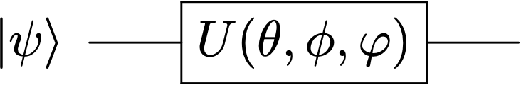

---
jupytext:
  text_representation:
    extension: .md
    format_name: myst
    format_version: 0.13
    jupytext_version: 1.15.2
kernelspec:
  display_name: Python 3 (ipykernel)
  language: python
  name: python3
---

+++ {"slideshow": {"slide_type": "slide"}}

# Puertas Simples


$ \newcommand{\bra}[1]{\langle #1|} $
$ \newcommand{\ket}[1]{|#1\rangle} $
$ \newcommand{\braket}[2]{\langle #1|#2\rangle} $
$ \newcommand{\ketbra}[2]{| #1\rangle  \langle #2|} $
$ \newcommand{\tr}{{\rm tr}} $
$ \newcommand{\i}{{\color{blue} i}} $ 
$ \newcommand{\Hil}{{\cal H}} $
$ \newcommand{\V}{{\cal V}} $

+++ {"slideshow": {"slide_type": "skip"}}


- [Rotaciones en la esfera de Bloch](#rotesf)


- [Puertas simples](#puertsimp)

```{code-cell} ipython3
---
slideshow:
  slide_type: slide
---
%run ../macro_CURSO.py
```

+++ {"slideshow": {"slide_type": "slide"}}

## Rotaciones en la esfera de Bloch

+++ {"slideshow": {"slide_type": "slide"}}

Un operador unitario conserva la norma y, por tanto, lleva un vector a otro de la misma esfera de Bloch 

Esta operación  se puede *visualizar* como una **rotación de un cierto ángulo en torno a algún eje**.

+++ {"slideshow": {"slide_type": "-"}}

<div>

</div>

+++ {"slideshow": {"slide_type": "slide"}}

<div class="alert alert-block alert-info",text-align:center>
<p style="text-align: left ;color: navy;">  
<b> Teorema</b>:
<br>
    El operador que efectúa una <i>rotación de ángulo</i>  $\alpha\in [0,2\pi)$ en torno al <i>eje que marca un vector unitario</i>  $\hat{\bf n}$ es el siguiente
<br> 
<br>    
\begin{eqnarray}
R_{\hat{\bf n}}(\alpha)~ = ~\exp\left( -i\frac{\alpha}{2} \hat{\bf n}\cdot \boldsymbol{\sigma} \right) ~=~ 
\cos \frac{\alpha}{2} I - i \sin\frac{\alpha}{2} \hat{\bf n}\cdot\boldsymbol{\sigma} 
\end{eqnarray}
</p>    
</div>    

+++ {"slideshow": {"slide_type": "fragment"}}

donde $\boldsymbol{\sigma} = (\sigma_x, \sigma_y, \sigma_z)$ son las matrices de Pauli
$$
\sigma_x = \begin{bmatrix} 0 & 1 \\ 1 & 0 \end{bmatrix}~~,~~
\sigma_y = \begin{bmatrix} 0 & -i \\ i & 0 \end{bmatrix}~~,~~
\sigma_z = \begin{bmatrix} 1 & 0 \\ 0 & -1 \end{bmatrix}~~.~~
$$

+++ {"slideshow": {"slide_type": "skip"}}

<div class="alert alert-block alert-danger",text-align:center>
<b> Nota</b>:
    el sentido de la rotación que produce $R_{\hat{\bf n}}(\alpha)$ en torno al eje $\hat{\bf n}$, viene dado por la <i>regla de la mano derecha</i> o, también, <i>anti-horario</i>. 
</div>

+++ {"slideshow": {"slide_type": "fragment"}}

Haciendo la suma explícitamente podemos escribir la matriz unitaria 
<br>
<br>

\begin{eqnarray}
R_{\hat{\bf n}}(\alpha)~  ~=~ 
 \begin{bmatrix} \cos \displaystyle\frac{\alpha}{2} - i n_z\sin\frac{\alpha}{2} &\displaystyle (-in_x- n_y)\sin\frac{\alpha}{2} \\ \displaystyle
(-in_x + ny) \sin\frac{\alpha}{2} & \displaystyle \cos \frac{\alpha}{2} + i n_z\sin\frac{\alpha}{2} \end{bmatrix}
\end{eqnarray}

+++ {"slideshow": {"slide_type": "slide"}}

### Rotaciones X, Y y Z

- Asociado a rotaciones en torno a los ejes $X$, $Y$ y $Z$ de un ángulo $\alpha$ encontramos las tres puertas siguientes


<br>

$$
\begin{array}{rcl}
\hat{\bf n} = (0,0,1) ~~\Rightarrow ~~ R_{z}(\alpha) &=&  \begin{bmatrix} e^{-i\alpha/2}  & 0 \\ 0 & e^{i\alpha/2}  \end{bmatrix}  ~,~\nonumber\\
\rule{0mm}{14mm}
\hat{\bf n} = (0,1,0) ~~\Rightarrow ~~ R_{y}(\alpha) &=&  \begin{bmatrix} \cos \alpha/2  & -\sin \alpha/2 \\   \sin\alpha/2 & \cos\alpha/2 \end{bmatrix}  \nonumber \\
\rule{0mm}{14mm}
\hat{\bf n} = (1,0,0) ~~\Rightarrow ~~ R_{x}(\alpha)  &=&  \begin{bmatrix} \cos\alpha/2  &- i\sin\alpha/2 \\   -i\sin\alpha/2& \cos\alpha/2 \end{bmatrix} \, .\nonumber
\end{array}
$$

<br>


+++ {"slideshow": {"slide_type": "skip"}}

### Parametrización de Euler

 Necesitamos *3 parámetros* para especificar una rotación general.
En $R_{\hat{\bf n}}(\theta)$ un parámetro es $\theta$ y otros dos entran  en $\hat{\bf n}$ con 
$  |\hat{\bf n}|=1$.

+++ {"slideshow": {"slide_type": "skip"}}

 La *parametrización de Euler* consiste en una *composición de tres rotaciones* sucesivas en torno a los ejes $z$, después  $y$ y  finalmente $z$ de nuevo:

+++ {"slideshow": {"slide_type": "skip"}}

Multiplicando las matrices asociadas, y extrayendo una fase global, definimos 

$$
 R_z(\phi)R_y(\theta)R_z(\varphi) = e^{-\frac{i}{2}(\phi + \varphi)}U(\theta,\phi,\varphi)  
$$

Los *ángulos de Euler* son $\theta,\phi $ y $\varphi$, 

+++ {"slideshow": {"slide_type": "skip"}}

**Rotación general**

$$
U(\theta,\phi,\varphi)=\begin{bmatrix}   \cos \displaystyle\frac{\theta}{2}  & - e^{i\varphi} \sin\displaystyle\frac{\theta}{2}  \\ 
\rule{0mm}{4mm} e^{i\phi} \sin \displaystyle\frac{\theta}{2} &e^{i(\varphi+\phi)} \cos \displaystyle\frac{\theta}{2} \end{bmatrix}
$$

<br>

+++ {"slideshow": {"slide_type": "skip"}}

Es evidente que la acción de este operador sobre la base  $\{\ket{0},\ket{1}\}$ 
una base alineada con el eje $(\theta,\phi)$
<br>

$$
U(\theta,\phi,\varphi)\begin{bmatrix} 1\\0\end{bmatrix} = \begin{bmatrix} \cos\displaystyle\frac{\theta}{2}\\ e^{i\phi} \sin \displaystyle \frac{\theta}{2} \end{bmatrix} ~~~~~~,~~~~~~~
U(\theta,\phi,\varphi)\begin{bmatrix} 0\\1\end{bmatrix} = \begin{bmatrix} -e^{i\varphi}\sin\displaystyle\frac{\theta}{2}\\ e^{i(\varphi + \phi)} \cos \displaystyle \frac{\theta}{2} \end{bmatrix} 
$$
<br>

+++ {"slideshow": {"slide_type": "skip"}}

## Puertas Simples

+++ {"slideshow": {"slide_type": "skip"}}

Por puertas simples entendemos un conjunto de *operadores unitarios* que se utilizan con frecuencia en la computación cuántica. Vamos a ver las puertas simples sobre 1 cúbit

+++ {"slideshow": {"slide_type": "skip"}}

### Puerta de fase 

- $P_\alpha = P(\alpha)$ con $\alpha \in [0,2\pi)$
<br>
<br>
$$
P(\alpha)= \begin{bmatrix}
1 & 0 \\ 0 & e^{i\alpha} 
\end{bmatrix}  =  \ketbra{0}{0} + e^{i\alpha}\ketbra{1}{1}
$$
<br>
es unitaria para todo $\alpha$ como se comprueba fácilmente. 
Aplicada a un estado de cúbit genérico 
<br>
<br>
$$
P(\alpha) \ket{u} =  \begin{bmatrix} 1 & 0 \\ 0 & e^{i\alpha} \end{bmatrix}
\begin{bmatrix} \cos\theta \\ \sin\theta e^{i\phi} \end{bmatrix} = \begin{bmatrix} \cos\theta \\ \sin\theta e^{i(\phi+\alpha)} 
\end{bmatrix}= \ket{v}
$$
<br>

+++ {"slideshow": {"slide_type": "skip"}}

El efecto de este operador es rotar cualquier cúbit en torno al eje Z un ángulo $\alpha$. Comprobamos que está relacionada con $R_z(\alpha)$
<br>
<br>
$$
P(\alpha) = \begin{bmatrix} 1 & 0 \\ 0 & e^{i\alpha} \end{bmatrix} = 
\begin{bmatrix} e^{i\alpha/2} & 0 \\ 0 & e^{i\alpha/2} \end{bmatrix} 
\begin{bmatrix} e^{-i\alpha/2} & 0 \\ 0 & e^{i\alpha/2} \end{bmatrix}   \equiv e^{i\alpha/2} R_z(\alpha)
$$
<br>
<br>
La fase global es trivial. Por tanto los dos operadores $P(\alpha)$ y $R_Z(\alpha)$ son equivalentes y producen el mismo efecto sobre la esfera de Bloch.


+++ {"slideshow": {"slide_type": "skip"}}

- $K_\alpha = K(\alpha)$
<br>
<br>
realmente es una fase trivial, pero a veces se utiliza
$$
K(\alpha)= e^{i\alpha} \begin{bmatrix}
1 & 0 \\ 0 & 1 
\end{bmatrix} =  e^{i\alpha}\left(\rule{0mm}{4mm} \ketbra{0}{0} + \ketbra{1}{1} \right) = e^{i\alpha} I 
$$

+++ {"slideshow": {"slide_type": "slide"}}

### Puertas Discretas

- $X,Y,Z$
<br>
<br>
La computación clásica se basa en la descomposición de algoritmos complejos en una serie de puertas lógicas elementales. Veremos que lo mismo ocurre con la computación cuántica. 
<br>
<br>
$$
\begin{eqnarray}
X &=&   \begin{bmatrix}0&1\\1&0\end{bmatrix} = \sigma_x = \ketbra{1}{0} + \ketbra{0}{1}~~~, ~~~ \\
Y &=&  \begin{bmatrix}0&-i\\i&0\end{bmatrix}= \sigma_y  =  i \ketbra{1}{0} - i \ketbra{0}{1}~~~, ~~~ \\
Z &=&   \begin{bmatrix}1&0\\0&-1\end{bmatrix}= \sigma_z = \ketbra{0}{0} - \ketbra{1}{1}  ~~~~, ~~~
\end{eqnarray}
$$
<br>
<br>
donde hemos remarcado la igualdad con las <i>matrices de Pauli</i>.


+++ {"slideshow": {"slide_type": "fragment"}}


<div class="alert alert-block alert-success">
<b>Ejercicio:</b> 
Relacionar  $X,Y,Z$ con   $R_x(\alpha),R_y(\alpha)$ y $R_z(\alpha)$ par algún valor de $\alpha$.
    
</div>

+++ {"slideshow": {"slide_type": "skip"}}

-  $S,T$

Cualquier potencia $U^k$ de un operador unitario es otro operador unitario. Esto es fácil de demostrar cuando $k=2$ pero es cierto en el caso general $k\in{\mathbb R}$. Así obtenemos
<br>

$$
S = Z^{1/2} =  \begin{bmatrix}1&0\\0&i\end{bmatrix}=\begin{bmatrix}1&0\\0&e^{i\pi/2}\end{bmatrix} ~~~~~,~~~~~~ T = S^{1/2} =  \begin{bmatrix}1&0\\0&e^{i\pi/4}\end{bmatrix}
$$

<br>


+++ {"slideshow": {"slide_type": "slide"}}

- $H$   

La puerta de Hadamard, $H$, es la primera puerta *genuinamente cuántica* en el sentido de que lleva un estado de la base a una superposición coherente
<br>

$$
H \ket{0} = \frac{1}{\sqrt{2}}\left(\rule{0mm}{4mm}\ket{0} + \ket{1}\right) =\ket{+}  ~~~~~~~~,~~~~~~~~~~
H \ket{1} = \frac{1}{\sqrt{2}}\left(\rule{0mm}{4mm}\ket{0} - \ket{1}\right) =\ket{-} 
$$

+++ {"slideshow": {"slide_type": "fragment"}}

Podemos escribir este operador en la base canónica $H = H_{ij}\ketbra{i}{j}$

\begin{eqnarray}
H &=&  \ket{+}\bra{0} +  \ket{-}\bra{1} \\
&=& \frac{1}{\sqrt{2}}(\ketbra{0}{0} + \ketbra{1}{0} + \ketbra{0}{1} - \ketbra{1}{1})
\end{eqnarray}


+++ {"slideshow": {"slide_type": "fragment"}}

De aquí obtenemos la representación matricial  
<br>
$$
H_{ij}   =  \frac{1}{\sqrt{2}} \begin{bmatrix} 1& 1 \\ 1 & -1 \end{bmatrix} 
$$
<br>


+++ {"slideshow": {"slide_type": "skip"}}

<div class="alert alert-block alert-danger",text-align:center>
<b> Nota</b>:
    en cálculos posteriores encontraremos muy útil la siguiente representación de la acción de $H$

$$
H \ket{x} =\frac{1}{\sqrt{2}} \sum_{y=0,1} (-1)^{ x  y} \ket{y}
$$
</div>

+++ {"slideshow": {"slide_type": "skip"}}


Como cualquier puerta, la acción de $H$ puede visualizarse como una rotación en la esfera de Bloch $H$ de $\pi$ radianes en torno a un eje diagonal situado a 45$^\circ$ entre el eje $x$ 
y el eje $y$. Esta rotación permuta los ejes $x$ y $z$ y cambia de sentido el eje $y$.

$$
\begin{array}{rcl}
\hat{\bf n} = \frac{1}{\sqrt{2}}(1,0,1) ~~~~~ \Rightarrow ~~~~~ R_{\hat{\bf n}}(\pi) &=&-i\frac{1}{\sqrt{2}} \begin{bmatrix} 1  & 1 \\ 1 & -1  \end{bmatrix} =-i H \sim H\nonumber\\
\end{array}
$$

+++ {"slideshow": {"slide_type": "skip"}}

Como toda rotación de $\alpha = \pi/2$, una segunda aplicación da lugar a la identidad

$$
H^2 = I
$$

+++ {"slideshow": {"slide_type": "skip"}}

### Descomposición 

Una noción muy práctica en computación cuántica es la descomposición de una puerta en producto de otras más simples. 

Para el caso de $H$, un poco de visión espacial muestra que su acción equivale a la composición de

- una  rotación de $\pi/2$ radianes sobre el eje $Y$ 


- seguida de una rotación de  $\pi$ radianes en torno al eje $X$. 


Lo demostramos algebraicamente (despreciando fases globales)

+++ {"slideshow": {"slide_type": "skip"}}

$$
 R_x(\pi)R_{y}\left(\frac{\pi}{2}\right) = \begin{bmatrix}0&-i\\-i&0\end{bmatrix} \begin{bmatrix}\cos\pi/4& -\sin\pi/4 \\ \sin\pi/4 & \cos\pi/4 \end{bmatrix} = \frac{1}{\sqrt{2}} \begin{bmatrix}0&1\\1&0\end{bmatrix} \begin{bmatrix}1 & -1 \\ 1 & 1 \end{bmatrix}  = \frac{-i}{\sqrt{2}} \begin{bmatrix}1&1\\1&-1\end{bmatrix} =-i H \sim H
$$

+++ {"slideshow": {"slide_type": "skip"}}


<div class="alert alert-block alert-success">
<b>Ejercicio:</b> 
Encontrar los ángulos $\theta,\phi,\varphi$ que hay que verifican las siguientes idendidades
    
    
 $$
 U(\theta,\phi,\varphi) = H ~~~~,~~~~  U(\theta,\phi,\varphi) = SH
 $$
</div>

+++ {"slideshow": {"slide_type": "slide"}}

## Circuitos Cuánticos

+++ {"slideshow": {"slide_type": "-"}}

La aplicación de una *puerta* se representa mediante un cuadrado que contiene los datos del operador asociado.
Por ejemplo, la aplicación del operador

<br>

$$
\ket{\psi} \to  U(\theta,\phi,\varphi)\ket{\psi}
$$

<br>

se representa mediante el circuito elemental siguiente

<br>

<div>

</div>

```{code-cell} ipython3
---
slideshow:
  slide_type: slide
---
from qiskit import Aer, execute, QuantumCircuit


theta = 1.2  #rad
phi   = 1.5
varphi = 0.

qc = QuantumCircuit(1,1)

qc.u(theta,phi,varphi,0) 

qc.draw(output='mpl')
```

+++ {"slideshow": {"slide_type": "skip"}}

### Simulador de estado

```{code-cell} ipython3
---
slideshow:
  slide_type: skip
---
S_simulator = Aer.get_backend('statevector_simulator')
stateresult = execute(qc,S_simulator).result()  

state_vector = stateresult.get_statevector(decimals=5)

# plot the state vector on the Bloch sphere
from qiskit.tools.visualization import plot_bloch_multivector
plot_bloch_multivector(state_vector)
```

```{code-cell} ipython3
---
slideshow:
  slide_type: skip
---
# print the state vector
from qiskit.quantum_info import Statevector
Statevector(state_vector).draw('latex')
```

```{code-cell} ipython3
---
slideshow:
  slide_type: skip
---
# alternative wat to plot the state vector on the Bloch sphere
Statevector(state_vector).draw('Bloch')
```

+++ {"slideshow": {"slide_type": "skip"}}

 La concatenación de puertas se corresponde con la *composición de operadores*, es decir, con la *multiplicación de las matrices* asociadas. 

+++ {"slideshow": {"slide_type": "skip"}}

<div class="alert alert-block alert-danger",text-align:center>
<b> Nota</b>:
<br>    
el <i>orden</i> en el que aparecen los operadores en la composición es el opuesto al que se aprecia en el circuito. Así por ejemplo a la composición de operadores 
<br>
$$
\ket{\psi} \to  TH \ket{\psi} 
$$
<br>
le corresponde un circuito en el que  $H$ está a la izquierda de $T$
</div>

```{code-cell} ipython3
---
slideshow:
  slide_type: skip
---
qc=QuantumCircuit(1,1)

'''aplicamos el operador TH '''
qc.h(0)
qc.t(0)

qc.draw(output='mpl')
```

+++ {"slideshow": {"slide_type": "skip"}}

### Matriz de un circuito

Todo circuito se corresponde con un operador unitario que se obtiene componiendo todos los operadores que figuran en el. Por ejemplo, el circuito anterior representa el operador unitario $U$ al que le corresponde la matriz obtenida por multiplicación
<br>
<br>
$$
U = T H ~~~\to ~~~ U_{ij} = \begin{bmatrix}1&0\\0&e^{i\pi/4}\end{bmatrix} \frac{1}{\sqrt{2}} \begin{bmatrix} 1& 1 \\ 1 & -1 \end{bmatrix}  = 
\frac{1}{\sqrt{2}} \begin{bmatrix} 1& 1 \\ e^{i\pi/4} & -e^{i\pi/4} \end{bmatrix} 
$$

```{code-cell} ipython3
---
slideshow:
  slide_type: skip
---
### Circuit matrix representation
U_simulator = Aer.get_backend('unitary_simulator')
job = execute(qc, backend = U_simulator)

U_matrix = job.result().get_unitary()

print(U_matrix)

'this looks very ugly, let us use latex'
from qiskit.tools.visualization import array_to_latex
array_to_latex(U_matrix, prefix="\\text{Unitary matrix = }\n")
```

+++ {"slideshow": {"slide_type": "skip"}}


El resultado de la aplicación sobre el vector $\ket{0}$ será


<br>

$$
\frac{1}{\sqrt{2}} \begin{bmatrix} 1& 1 \\ e^{i\pi/4} & -e^{i\pi/4} \end{bmatrix} \begin{bmatrix}1 \\ 0 \end{bmatrix}
 = \frac{1}{\sqrt{2}} \begin{bmatrix} 1  \\ e^{i\pi/4}  \end{bmatrix} 
$$
<br>

+++ {"slideshow": {"slide_type": "skip"}}

Podemos anticipar el resultado: 
- el operador $H$
lleva el vector $\ket{0}$ sobre el eje $z$ al vector $\ket{+}$ que se halla sobre el eje $x$.  

- posterioremente, $T$ es una rotación de ángulo $\pi/4$ en torno al eje $z$ que moverá el vector $\ket{+}$ sobre el plano ecuatorial. Veamos el resultado

```{code-cell} ipython3
---
slideshow:
  slide_type: skip
---
statejob=execute(qc,S_simulator) 
stateresult=statejob.result()  

# print the state vector
state_vector = stateresult.get_statevector(decimals=5)
print(state_vector)

# plot the state vector on the Bloch sphere
from qiskit.tools.visualization import plot_bloch_multivector

plot_bloch_multivector(state_vector)
```
