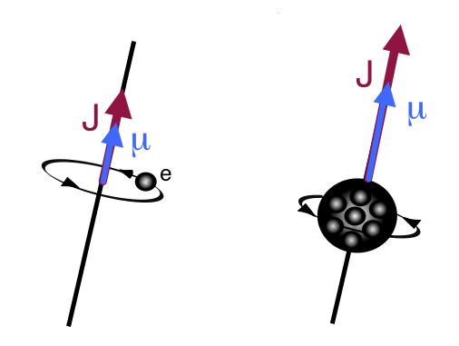
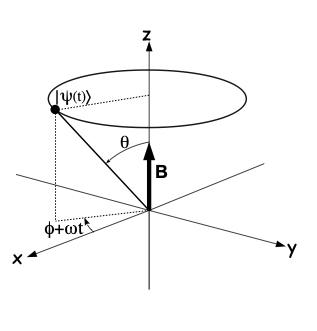
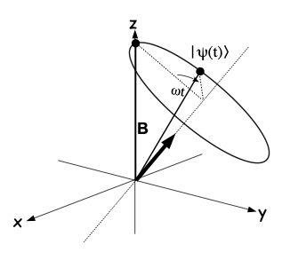

---
jupytext:
  text_representation:
    extension: .md
    format_name: myst
    format_version: 0.13
    jupytext_version: 1.15.2
kernelspec:
  display_name: Python 3 (ipykernel)
  language: python
  name: python3
---

+++ {"slideshow": {"slide_type": "slide"}}

# El cúbit de espín 

$ \newcommand{\bra}[1]{\langle #1|} $
$ \newcommand{\ket}[1]{|#1\rangle} $
$ \newcommand{\braket}[2]{\langle #1|#2\rangle} $
$ \newcommand{\i}{{\color{blue} i}} $ 
$ \newcommand{\Hil}{{\mathcal H}} $

$ \newcommand{\bn}{{\bf n}} $

+++ {"slideshow": {"slide_type": "skip"}}

- [Experimento de Stern y Gerlach](#sterngerlach)

    
- [Preparando de un cúbit](#prepacubit)
    
    
- [Manipulando un cúbit](#manipcubit)

+++ {"slideshow": {"slide_type": "skip"}}

El descubrimiento del espín fue una de los primeros fenómenos cuya descripción encontró acomodo en la nueva Mecánica Cuántica. 

+++ {"slideshow": {"slide_type": "skip"}}


Tanto es así que, el espín es un paradigma de *grado de libertad cuántizado*, y permite obtener intuición sobre los procesos de medida generales.

+++ {"slideshow": {"slide_type": "slide"}}

## Momentos magnético y angular

Clásicamente una distribución de carga que rota posee un *momento angular* de rotación ${\bf J}$ y un *momento magnético* $\boldsymbol{\mu}$ que son proporcionales

+++ {"slideshow": {"slide_type": "skip"}}

Por ejemplo, un átomo formado por un electrón de carga $q$ rotando en torno al núcleo tendrá
<br>

$$
\boldsymbol{\mu} = \frac{q}{2m} {\bf J} = \gamma {\bf J}
$$

La constante de proporcionalidad,  $\gamma$, se denomina *razón giromagnética*

+++ {"slideshow": {"slide_type": "-"}}


<div>

</div>


+++ {"slideshow": {"slide_type": "skip"}}

En este sentido, conocer el valor de $\boldsymbol{\mu}$ es equivalente a  *medir* ${\bf J}$ 

La manera de poner de manifiesto el momento magnético es sumergir el átomo en un campo magnético ${\bf B}$. Se observan dos efectos

+++ {"slideshow": {"slide_type": "skip"}}

- En un campo magnético constante, el átomo adquiere una energía de interacción 

$$
U = -\boldsymbol{\mu}\cdot {\bf B} = - \mu B \cos \theta
$$

y modificará  su estado  rotación para tratar de alinear $\boldsymbol{\mu}$ paralelamente a $ {\bf B}$, de forma que $U$ se minimice.

+++ {"slideshow": {"slide_type": "skip"}}

-  Si el campo magnético no es constante, ${\bf B} = {\bf B}(x,y,z)$, el átomo  actúa una fuerza proporcional al gradiente del campo magnético

$$
{\bf F} = - \boldsymbol{\nabla} U(x,y,z) = \boldsymbol{\nabla} ( \boldsymbol{\mu}\cdot {\bf B}(x,y,z) )
$$

+++ {"slideshow": {"slide_type": "slide"}}

## El experimento de Stern y Gerlach

+++ {"slideshow": {"slide_type": "-"}}

En 1921 Stern, e independientemente en 1922 Gerlach, dispararon una nube de átomos de plata en el seno de un campo magnético no constante ${\bf B}(z) = (0,0,B_z(z))$

+++ {"slideshow": {"slide_type": "skip"}}

El *momento magnético* $\boldsymbol{\mu}$ en dichos átomos está asociado al *momento angular del  último* electrón de valencia.


+++ {"slideshow": {"slide_type": "skip"}}

En este caso, la fuerza esperable que desvíe un átomos de momento angular ${\bf J}$ 
<br>

$$
{\bf F}= -\boldsymbol{\nabla} U = \boldsymbol{\nabla}(\boldsymbol{\mu}\cdot{\bf B}(z))= \left( \hat{\bf x}\frac{\partial}{\partial x}+ 
\hat{\bf y}\frac{\partial}{\partial y}+ \hat{\bf z}\frac{\partial}{\partial z}\right)(\mu_z B_z(z)) =  \gamma J_z\frac{\partial B_z(z)}{\partial z} \, \hat{\bf z}
$$

+++ {"slideshow": {"slide_type": "skip"}}

Vemos que 

- es una fuerza vertical. Esta es la dirección en la que esperamos una desviación de un electrón que lo atravies
<br>

- la magnitud de dicha desviación es proporcional a la proyección vertical del momento angular $J_z = \boldsymbol{J}\cdot\hat{\bf z} $ 

+++

<a title="Theresa Knott from en.wikipedia, CC BY-SA 3.0 &lt;http://creativecommons.org/licenses/by-sa/3.0/&gt;, via Wikimedia Commons" href="https://commons.wikimedia.org/wiki/File:Stern-Gerlach_experiment.PNG"></a>

+++ {"slideshow": {"slide_type": "skip"}}

La nube de electrones que atraviesa el campo magnético está inicialmente despolarizada. Eso quiere decir que, en promedio, el momento angular es cero.

+++ {"slideshow": {"slide_type": "skip"}}

Cada componente, y en particular $\mu_z$, será una distribución constante $\mu_z\in [-\mu,+\mu]$ de media cero. Por tanto, a la salida del polarizador esperamos una nube verticalmente alargada centrada en la posición central.

+++ {"slideshow": {"slide_type": "skip"}}

El resultado del experimento de Stern (1921) y Gerlach (1922) fue que, en lugar de eso, sólo se encuentran dos puntos de acumulación, situados simétricamente en la dirección del eje del polarizador. 

+++ {"slideshow": {"slide_type": "skip"}}

Esto quiere decir que la variable $J_z$ sólo adquiere dos valores opuestos

$$J_z = \pm\frac{\hbar}{2}$$

+++ {"slideshow": {"slide_type": "skip"}}

<div class="alert alert-block alert-danger">
<b>Notar</b> : la dirección $z$ no tiene nada de particular. Si el eje del polarizador apunta en la dirección $\hat{\bf n}$, los puntos de acumulación se situaciónan a lo largo de dicho eje, y para cáda átomo estaríamos midiendo el valor de la proyección $J_{\hat{\bf n}}={\bf J}\cdot\hat{\bf n} = \pm \hbar/2$.
    
</div>

+++ {"slideshow": {"slide_type": "skip"}}

### Mediciones sucesivas

El nombre de *polarizador* cobra sentido cuando hacemos dos experimentos sucesivamente de forma que, la salida de uno, sea la entrada del siguiente. 

+++ {"slideshow": {"slide_type": "skip"}}

Supongamos que seleccionamos sólo los electrones que se desvían hacia arriba $+\hbar/2$ en el primer polarizador. 

A continuación  los hacemos pasar por un segundo polarizador de Stern Gerlach cuyo eje se desvía de la vertical en el plano perpendiclar $(y,z)$ un ángulo $\theta$ relativo al eje $z$. 

*Resultado*:  las incidencias sobre la segunda placa  aparecen en una u otra posición a lo largo del *segundo eje* de *forma aleatoria*. 

+++ {"slideshow": {"slide_type": "skip"}}

Repitiendo el experimento obtenemos la frecuencia relativa de incidencia en una posición u otra y, de ahí, la probabilidad de ocurrencia de cada resultado

$$
p(+\hbar/2) = \cos^2\theta/2 ~~~~~,~~~~~  p(-\hbar/2) = \sin^2\theta/2 ~\, 
$$

donde $\theta$ es el ángulo entre los ejes de los dos polarizadores sucesivos.

+++ {"slideshow": {"slide_type": "skip"}}


+++ {"slideshow": {"slide_type": "skip"}}

En esta figura se aprecia que la polarización del resultado en una dirección (selección de un resultado, por ejemplo $+\hbar/2$), arroja una distribución equilibrada de resultados en el polarizador siguiente, rotado $90^\circ$

+++ {"slideshow": {"slide_type": "skip"}}

La interpretación de este experimento indica que cada polarizador *prepara* a su salida, un estado que es base de un operador relacionado con su orientación. 

- a la salida del primer polarizador, uno de los dos posibles autoestados de $\sigma_z$, $\ket{\pm}_z$


- a la salida del segundo polarizador, uno de los posibles autestados de $\sigma_x$, $\ket{\pm}_x$

Dado que $[\sigma_z,\sigma_x]\neq 0$ no conmutan, es imposible encontrar una base común de autoestados de ambos operadores. 

Esto hace que siempre que actúa un Stern Gerlach, las medidas en el siguiente aparezcan máximamente despolarizadas.  En última instancia esto es una manifestación del principio de incertidumbre obligado por la relación 

$$
[\sigma_z, \sigma_x] = i \sigma_y
$$

+++ {"slideshow": {"slide_type": "skip"}}

### Espín

La desviación del átomo de plata en el experimento de Stern y Gerlach se debe al último electrón. Pero no puede provenir de su movimiento ya que el *momento angular orbital* del último electrón es nulo al hallarse en el orbotal $5s$, es decir, tendríamos $~{\bf J} = {\bf L} = 0$.

+++ {"slideshow": {"slide_type": "skip"}}

En conclusión: tiene que haber una contribución  de  *carácter interno* 

$$
{\bf J} = {\bf L} + {\bf S}  ~~\Rightarrow~~
 \boldsymbol{\mu} =  \boldsymbol{\mu}_L +  \boldsymbol{\mu}_S  $$
con

$$
\boldsymbol{\mu}_S =\gamma_e {\bf S} =   g_s\frac{ q}{2 m_e} {\bf S} 
$$

y $g_s = 2,0023...$ el *factor giromagnético* del electrón.

+++ {"slideshow": {"slide_type": "skip"}}

Es como si el electrón mismo tuviese momento angular interno, pero tratándose de una partícula puntual esto sólo puede entenderse como un símil, no como una nube de carga real en rotación

+++ {"slideshow": {"slide_type": "skip"}}

La variable ${\bf S}$ se denomina *espín* y  $S_z = \pm \hbar/2$ es su *proyección* en la dirección dirección $\hat{\bf z}$.  

Muchas veces se omite el factor $\hbar$ y se dice que el electrón tiene espín $1/2$.

+++ {"slideshow": {"slide_type": "skip"}}

En otras palabras, *el observable* asociado a la medición de la proyección del espín en la dirección $z$ es 

$$
S = \frac{\hbar}{2}\sigma_z ~~~~~~ \Rightarrow ~~~~~~~S \ket{\pm} = \pm\frac{\hbar}{2} \ket{\pm}
$$

+++ {"slideshow": {"slide_type": "skip"}}

<div class="alert alert-block alert-danger">
<b>Notar</b>

Con frecuencia se usan unidades en las que $\hbar = 1$, por lo que la proyección del espín del electrón será siempre $\pm 1/2$.
    
    
Todas las partículas elementales tienen espín: 

- $S=1/2$ los fermiones (quarks, electrón, muón, neutrino,...)


- $S = 0$ el bosón de Higgs


- $S=1$ los bosones intermediarios (fotón, gluón, W,Z,...)
    
Las partículas compuestas tienen espín formado por el de los componentes 

 - protón, neutrón tienen $S=1/2$ y son fermiones
 
 
 - núcleos tienen $S=1/2$ ó $0$  si tienen un número impar o par de nucleones
</div>

+++ {"slideshow": {"slide_type": "skip"}}

## Preparación de un cúbit de espín

+++ {"slideshow": {"slide_type": "slide"}}

Un *Stern-Gerlach* con el campo magnético ${\bf B}$ alineado con el eje $~\hat\bn = (0,0,1)$
prepara el estado entrante en uno de los dos estados $\{\ket{+},\ket{-}\}$, autoestados del operador $\sigma_z$,

$$
\sigma_z \, \ket{\pm} = \pm \ket{\pm}
$$

donde cada resultado es observado <u>en función de la deflexión observada a su salida</u>

+++ {"slideshow": {"slide_type": "slide"}}

Sin embargo, <u>*no hay nada de especial*</u> en la elección del eje $z$ para orientar el campo magnético. 

Experimentalmente obtenemos el mismo efecto cuando orientamos el eje del *Stern-Gerlach*  con su campo magnético ${\bf B}$ en la dirección de un vector unitario, $|\hat\bn|=1$, con
<br>
<br>

$$
\hat\bn(\theta,\phi) = \sin\theta\cos\phi \, \hat {\bf x} + \sin\theta\sin\phi \, \hat {\bf y} + \cos\theta \, \hat {\bf z}
$$
<br>

Al hacer pasar una electrón a través de dicho Stern Gerlach y observar su deflexión obtenemos igualmente dos resultados posible.

+++ {"slideshow": {"slide_type": "skip"}}


Si, a la salida, observamos que se deflectó en el mismo sentido de $\vec B$ (sentido opuesto a $\vec B$) diremos que, como resultado de la medición: 
<br>
el espín del electrón, $S$, <b>adquirió</b> una proyección  $+\hbar/2$ $(-\hbar/2)$
    <u>a lo largo del eje que marca el <i>Stern-Gerlach</i></u>, $~\hat\bn(\theta,\phi)~$.
    

+++ {"slideshow": {"slide_type": "slide"}}

Los dos estados asociados los denominaremos $\ket{\pm}_{\hat\bn} = \ket{\pm,\hat\bn}$. 

Deben ser autoestados de una ecuación que generalice y se reduzca a la anterior cuando $\hat\bn = \hat{\bf z}$

$$
(\hat\bn\cdot \boldsymbol{\sigma} )\,\ket{\pm,\hat\bn} = \pm \ket{\pm,\hat\bn}
$$


+++ {"slideshow": {"slide_type": "fragment"}}

Es inmediato comprobar que, los autoestados son los vectores de la esfera de Bloch que usan *los mismos ángulos* 
$(\theta, \phi)$
<br>
<br>
$$
\ket{+,\hat\bn} =  \begin{bmatrix} \cos\displaystyle\frac{\theta}{2} \\  e^{i\phi}\sin\displaystyle\frac{\theta}{2} \end{bmatrix} ~~~~~~~~,~~~~~
~~~~~
\ket{-,\hat\bn} =  \begin{bmatrix} -e^{-i\phi}\sin\displaystyle\frac{\theta}{2} \\  \cos\displaystyle\frac{\theta}{2} \end{bmatrix} 
$$


+++ {"slideshow": {"slide_type": "fragment"}}

<div class="alert alert-block alert-success",text-align:center>
<p style="text-align: left ;">  
<b>Ejericio</b>: 
comprueba, que los estados $\ket{\pm,\hat\bn}$ son ortogonales, y son autoestados del operador $~ \hat{\bf n} \cdot \boldsymbol{\sigma} ~$, con autovalores $~\pm 1$
</p>    
</div>

+++ {"slideshow": {"slide_type": "skip"}}

 En cada caso, a la salida, escribiremos para la función de onda total
<br>
<br>
$$~\ket{\psi} = \psi(\vec r)\otimes \ket{\pm,\hat\bn }~$$ 
<br>
cuya interpretación es la *amplitud de probabilidad* de encontrar al alectrón en el punto $\vec r$ con la proyección de su espín en la dirección $\hat\bn$ igual a $\pm 1$

+++ {"slideshow": {"slide_type": "slide"}}

<div class="alert alert-block alert-danger",text-align:center>
<p style="text-align: ">  <b>En resumen:</b>
<br>

- El observable asociado a un polarizador de Stern Gerlach <i>orientado</i> en una dirección $\hat\bn$ es
el operador
<br>    
$$
{\bf S} = \frac{\hbar}{2}\, \hat\bn\cdot  \boldsymbol{\sigma} 
$$
<br>

- Si se registra $+$,  estado de espín emergente $\ket{+,\hat\bn}$ es el <i>cúbit</i> que tiene, en la esfera de Bloch,   los mismos ángulos $(\theta, \phi)$  que definen la orientación del <i>Stern-Gerlach</i> en el laboratorio  
</div>

+++ {"slideshow": {"slide_type": "skip"}}

En particular cuando $\theta = \phi =  0 ~\Rightarrow \hat{\bf n} = (0,0,1) = \hat{\bf z}$, recuperamos la base $Z$
<br>
<br>
$$
\ket{+,\hat{\bf z}} =  \begin{bmatrix} 1 \\  0 \end{bmatrix} ~~~~~~~~,~~~~~
~~~~~
\ket{-,\hat{\bf z}} =  \begin{bmatrix} 0 \\  1\end{bmatrix} 
$$


+++ {"slideshow": {"slide_type": "skip"}}

<div class="alert alert-block alert-success">
<b>Ejercicio:</b> 
<br>
Supongamos que estamos en posesión de un cúbit en uno de los dos estados $\ket{\pm,\hat{\bf n}}$. Demuestra que podemos hallar la orientación del <i>Stern-Gerlach</i> que lo preparó  hallando valores medios de los operadores de Pauli
<br>    
<br>    
$$
\bra{\pm,\hat{\bf n}} \, \boldsymbol{\sigma}\,  \ket{\pm,\hat{\bf n}} = \pm \hat{\bf n}
$$
<br>    
</div>

+++ {"slideshow": {"slide_type": "skip"}}

## Manipulando un cúbit

+++ {"slideshow": {"slide_type": "skip"}}

 Ahora podemos preguntarnos qué le ocurre a dicho electrón si lo sumergimos en un campo magnético ${\bf B}$.

+++ {"slideshow": {"slide_type": "skip"}}

El Hamiltoniano de una partícula con espín en un campo magnético es

$$
H = -\hat{\boldsymbol{\mu}}\cdot {\bf B} = -\gamma \hat{\bf S}\cdot {\bf B} =  -\gamma \frac{\hbar}{2} \boldsymbol{\sigma}\cdot {\bf B}
$$

El *factor giromagnético* $\gamma$ depende de qué tipo de partícula  estamos estudiando (electrón, protón, núcleo...) 

+++ {"slideshow": {"slide_type": "skip"}}


Definiremos el  *vector de Larmor* 
<br>

$$
\boldsymbol{\omega} = \gamma \bf B
$$
<br>

cuyo módulo será la *frecuencia de Larmor*
$$
\omega = \gamma B ~~
~[\hbox{Hz}]
$$

Notar que $B$ es positivo. De modo que $\omega$ tendrá el signo de $\gamma$ y por tanto el de $q$

+++ {"slideshow": {"slide_type": "skip"}}

con esta definición, el Hamiltoniano  se escribe en la forma

$$
H =  \frac{\hbar}{2}(-\gamma {\bf B})\cdot \boldsymbol{\sigma}= -\frac{\hbar}{2} \boldsymbol{\omega}\cdot \boldsymbol{\sigma}
$$


+++ {"slideshow": {"slide_type": "skip"}}

Si uno mira las unidades de la ecuación anterior verá que

- $[H]$ el hamiltoniano tiene unidades de energía, por ejemplo, julio, J.


- $[\hbar]$ la constante de Planck, tiene unidades de energía $\times$ tiempo, es decir, J s. 

+++ {"slideshow": {"slide_type": "skip"}}

Consistentemente

- $\boldsymbol{\omega} = \gamma {\bf B}$ es un vector que tiene unidades de inversa de tiempo, de hecho rad s$^{-1}$.

+++ {"slideshow": {"slide_type": "skip"}}

De hecho **cualquier Hamiltoniano** 2$\times$2 se puede escribir de esta forma, que admite la interpretación de un espín en un campo magnético identificando$\boldsymbol{\omega} = \gamma \bf B$.

+++ {"slideshow": {"slide_type": "skip"}}

<div class="alert alert-block alert-success">
<b>Ejercicio:</b> 
dado un Hamiltoniano
$$
H =  \begin{bmatrix} E_1 & H_{12} \\ H_{12}^* & E_2 \end{bmatrix}
$$
    obtén el <i>vector de Larmor efectivo</i> $\boldsymbol{\omega}$ asociado  
    
<details><summary> <p style='text-align:right'> >>Solution </p> </summary>
\begin{eqnarray}
H &=& \begin{bmatrix} E_1 & H_{12} \\ H^*_{12} & E_2 \end{bmatrix} \nonumber\\
&=& \rule{0mm}{8mm}\frac{H_{11} + H_{22}}{2} I + \frac{E_1 - E_2}{2}\sigma_z + {\rm Re}(H_{12})\sigma_x - {\rm Im}(H_{12})\sigma_y
\nonumber\\
&=&  \rule{0mm}{8mm}\frac{E_1 + E_2}{2} I  - \frac{\hbar}{2} \boldsymbol{\omega} \cdot \boldsymbol{\sigma} \label{cambioB}
\end{eqnarray}
donde definimos el vector de Larmor efectivo
$$
\omega_x = -\frac{2}{\hbar } {\rm Re} (H_{12})~~ ,~~~~   \omega_y =  \frac{2}{\hbar } {\rm Im} (H_{12}) ~~,~~~~\omega_z =  \frac{ E_{2}-E_{1}}{\hbar } 
$$ 
</details>
</div>

+++ {"slideshow": {"slide_type": "skip"}}

De la sección anterior, ya sabemos cuáles son los autoestados de $H$

Por ejemplo, tomando ${\bf B} = B\, \hat{\bf z}$ a lo largo del eje $\hat{\bf z}$ vemos que $\boldsymbol{\omega} = (0,0,\omega)$ y 

<br>

$$
H = -\frac{\hbar}{2}\omega \sigma_z = \begin{bmatrix} -\hbar\omega/2 & 0 \\ 0 & \hbar\omega/2 \end{bmatrix}
$$

+++ {"slideshow": {"slide_type": "skip"}}

<br>

 - El estado *fundamental* es $\begin{bmatrix} 1\\ 0\end{bmatrix} =\ket{+,\hat{\bf z}}=\ket{1}$ con energía $\varepsilon_0=-\hbar \omega/2$. 
 

+++ {"slideshow": {"slide_type": "skip"}}

<br>

 - El estado *excitado*
 es $\begin{bmatrix} 1\\ 0\end{bmatrix} =\ket{-,\hat{\bf z}}= \ket{0}$ con energía $\varepsilon_1=\, \hbar \omega/2$. 
 

+++ {"slideshow": {"slide_type": "skip"}}

Al igual que clásicamente, con carga positiva $\gamma> 0$  el estado que minimiza la energía es el que, en la esfera de Bloch, es paralelo a la dirección del campo magnético en el espacio 

+++ {"slideshow": {"slide_type": "skip"}}

<div class="alert alert-block alert-danger">
<b>Notar</b>
<br>
    
- Observamos como *la presencia del campo magnético* induce una *separación de niveles* o *gap* de energía 

    $$\Delta \varepsilon = \varepsilon_1-\varepsilon_0 = \hbar \omega$$ 
   
<br>
    
- Este efecto se denomina *efecto Zeeman*
    
<br>    
    
- Con frecuencia se habla la *frecuencia del gap*  $\omega = \Delta \varepsilon/\hbar = $ y sus unidades son  [rad s$^{-1}$]  
    
<br>
    
- El eje $\hat{\bf z}$ no tiene nada de especial. Y la observación anterior se generaliza a cualquier campo magnético ${\bf B}= B\, \hat{\bf u}$. El Hamiltoniano asociado tendrá ahora dos autoestados $\{\ket{-,\hat{\bf u}},\ket{+,\hat{\bf u}}\}$ con idénticas energías $\varepsilon_{0}$ y $\varepsilon_1$.

</div>

+++ {"slideshow": {"slide_type": "skip"}}

## Evolución de un espín en un campo magnético. 

+++ {"slideshow": {"slide_type": "skip"}}

Situemos un espín $\ket{\psi} = \ket{s,\hat\bn}$ en un campo magnético vertical ${\bf B}= B \, \hat{\bf z}$\, .
La evolución en el tiempo, $\ket{\psi(t)}$,  viene gobernada por la ecuación de Schrödinger

$$
i\hbar \frac{d}{dt} \ket{\psi(t)} = H \ket{\psi(t)}
$$

+++ {"slideshow": {"slide_type": "skip"}}


Cuando $H$ es un operador constante en el tiempo (por ejemplo si el campo $\bf B$ no varía) existe una solución exacta para la evolución
<br>

$$
\ket{\psi(t)} = U(t,0) \ket{\psi(0)}
$$

+++ {"slideshow": {"slide_type": "skip"}}

que involucra el *operador de evolución*  
$$
U(t,0) = \exp\left( -\frac{i}{\hbar} t H\right)
$$

+++ {"slideshow": {"slide_type": "skip"}}


En la base que diagonaliza el operador, es equivalente a exponenciar los elementos diagonales. Es el caso cuando tomamos el campo magnético  a lo largo del eje $\hat{\bf z}$, ${\bf B} = B\, \hat{\bf z}$

$$
\exp\left( -\frac{i}{\hbar} t H\right)= \exp\left( -\frac{i}{\hbar} t\left(- \frac{\hbar}{2}\omega \sigma_z \right)\right) = \exp \begin{bmatrix} it \omega/2 & 0 \\ 0 & -it \omega/2 \end{bmatrix} =
\begin{bmatrix} e^{it \omega/2} & 0 \\ 0 &e^{-it \omega/2}  \end{bmatrix} =  e^{it \omega/2}
\begin{bmatrix}1 & 0 \\ 0 &e^{-it \omega}\end{bmatrix}
$$

+++ {"slideshow": {"slide_type": "skip"}}

Podemos despreciar la *fase global* y escribir para el operador de evolución

$$
U(t,0) = \begin{bmatrix}1 & 0 \\ 0 &e^{-it \omega}\end{bmatrix}
$$

+++ {"slideshow": {"slide_type": "skip"}}

Ya podemos obtener la evolución en el tiempo de un estado inicial de la polarización del espín. Supongamos que, a tiempo $t=0$, tenemos

$$
\ket{\psi(0)} =  \begin{bmatrix} \cos\theta \\ e^{i\phi} \sin\theta \end{bmatrix}
$$

+++ {"slideshow": {"slide_type": "skip"}}

A tiempo $t$ el estado será
<br>
<br>

$$
\ket{\psi(t)} = U(t,0) \ket{\psi(0)} = \begin{bmatrix}1 & 0 \\ 0 &e^{it \omega}\end{bmatrix}\begin{bmatrix} \cos\theta \\ e^{i\phi} \sin\theta \end{bmatrix} = 
\begin{bmatrix} \cos\theta \\ e^{i(\phi- t\omega)} \sin\theta \end{bmatrix}
$$

+++ {"slideshow": {"slide_type": "skip"}}

El resultado es fácil de visualizar:  en la esfera de Bloch, el estado instantáneo $\ket{\psi(t)} = \begin{bmatrix} \cos\theta \\ e^{i(\phi- t\omega)} \sin\theta \end{bmatrix}$,  experimenta 
- una *precesión de Larmor* en torno que marca el campo magnético, preservando el  ángulo $\theta$ inicial fijo, 


- con una velocidad angular dada por la *frecuencia de Larmor*, $\omega = \gamma B~$ [rad s$^{-1}$] en sentido horario $\omega >0$ (antihorario $\omega <0$) para una partícula de carga positiva (negativa)


+++ {"slideshow": {"slide_type": "skip"}}

<div>

</div>

+++ {"slideshow": {"slide_type": "skip"}}

-  la probabilidad de *decaer* al estado fundamental $\ket{+,\hat{\bf z}}=\begin{bmatrix}1 \\ 0\end{bmatrix}$ es $\cos^2 \theta$, y es invariante bajo evolución temporal

+++ {"slideshow": {"slide_type": "skip"}}

<div class="alert alert-block alert-danger">
<b>Notar</b>
<br>

-  Observamos como *la presencia del campo magnético* induce una *separación de niveles* o *gap* de energía 
    
    
-  los dos autoestados del hamiltoniano $\ket{\pm,\hat{\bf z}}$  de energías $\pm \hbar\omega/2$   son *estables* bajo evolución temporal. 
    
    
-  esto los hace útiles para computación cuántica $\Rightarrow$ un hamiltoniano *congela* ciertos estados, sus autoestados, siempre que <i> no sean degenerados </i>  

+++ {"slideshow": {"slide_type": "skip"}}

### Control cuántico

La elección del eje $\hat{\bf z}$ para alinear el campo magnético es *totalmente arbitraria* y se ha elegido para simplificar los cálculos, al ser el Hamiltoniano diagonal. Si escogiésemos otra dirección arbitraria:

- el resultado físico **tiene que ser el mismo**: una *precesión de Larmor* del vector de Bloch en torno al eje que marca el campo magnético ${\bf B}$ con *frecuencia angular de Larmor* $\omega = \gamma B$.


+++ {"slideshow": {"slide_type": "skip"}}

- el álgebra será más complicada porque tendremos que exponenciar una matriz  $H = -\frac{\hbar}{2}\boldsymbol{\omega}\cdot\boldsymbol{\sigma} $ que ya no es diagonal

$$
U_{\boldsymbol{\omega}}(t,0) = \exp\left( -\frac{i}{\hbar} t H\right) = \exp\left( \frac{i}{\hbar} t \frac{\hbar}{2}\boldsymbol{\omega}\cdot \boldsymbol{\sigma}\right)  =  
 \exp\left( i\frac{t\omega}{2}  \frac{\boldsymbol{\omega}}{\omega}\cdot \boldsymbol{\sigma}\right)
$$

+++ {"slideshow": {"slide_type": "skip"}}

-  Observamos que $U_{\boldsymbol{\omega}}(t,0)$ es el operador de rotación de ángulo $\alpha = -t\omega$ en torno al eje $\hat{\bf n} = \boldsymbol{\omega}/\omega$.

+++ {"slideshow": {"slide_type": "skip"}}

<div>

</div>

+++ {"slideshow": {"slide_type": "skip"}}

El resultado general es el siguiente

\begin{eqnarray}
U_{\boldsymbol{\omega}}(t,0) ~&=&~ \cos\left(\frac{t\omega}{2}\right) I + i \sin\left(\frac{t\omega}{2}\right) \, \frac{\boldsymbol{\omega}}{\omega}\cdot \boldsymbol{\sigma} \\
&&\\
&=& 
\begin{bmatrix}
 \cos \displaystyle\frac{t\omega}{2}+ i \displaystyle\frac{\omega_z}{\omega} \sin\displaystyle\frac{t\omega}{2}  &   \displaystyle\frac{\omega_y+i\omega_x}{\omega} \sin\displaystyle\frac{t\omega}{2}  \\
 \rule{0mm}{8mm}
 \displaystyle\frac{-\omega_y+i\omega_x}{\omega} \sin\displaystyle\frac{t\omega}{2}  & \cos\displaystyle\frac{t\omega}{2} - i \displaystyle\frac{\omega_z}{\omega} \sin\frac{t \omega }{2}
\end{bmatrix}
\end{eqnarray}


+++ {"slideshow": {"slide_type": "skip"}}

Supongamos que, a $t=0$, nos encontramos en el estado $\ket{\psi(0)} = \ket{0} = \ket{+,\hat{\bf z}}$. Entonces a tiempo $t$ el estado 
será

$$
\ket{\psi(t)}=U_{\boldsymbol{\omega}}(t,0)\begin{bmatrix} 1 \\ 0 \end{bmatrix} = \begin{bmatrix}
\cos \displaystyle\frac{t\omega}{2}+ i \displaystyle\frac{\omega_z}{\omega} \sin\displaystyle\frac{t\omega}{2} \\ \rule{0mm}{8mm}
 \displaystyle\frac{-\omega_y+i\omega_x}{\omega} \sin\displaystyle\frac{t\omega}{2} 
\end{bmatrix} 
$$

+++ {"slideshow": {"slide_type": "skip"}}

La probabilidad de medir el estado $\ket{0}$ o el estado $\ket{1}$ en ese instante será
<br>

\begin{eqnarray}
p_0(t) &=& |\braket{0}{\psi(t)}|^2 =  \cos^2 \frac{t\omega}{2} + \frac{\omega_z^2}{\omega^2} \sin^2 \frac{t\omega}{2} \\ \rule{0mm}{8mm}
p_1(t) &=&|\braket{1}{\psi(t)}|^2 =  \frac{\omega_x^2 + \omega_y^2}{\omega^2} \sin^2\frac{t\omega}{2}
\end{eqnarray}

```{code-cell} ipython3
---
slideshow:
  slide_type: skip
---
import numpy as np
import matplotlib.pyplot as plt

tlist = np.linspace(0,10,101)

wz = 0.8 # la componente w_z 
w  = 1   # el módulo de w
wxy = np.sqrt(w**2-wz**2) ## esto es sqrt(w_x**2 + w_y**2)
p0list08= np.cos(tlist*w/2)**2 + (wz/w)**2*np.sin(tlist*w/2)**2
p1list08=  (wxy/w)**2*np.sin(tlist*w/2)**2

wz = 0.2
w  = 1
wxy = np.sqrt(w**2-wz**2)  
p0list02= np.cos(tlist*w/2)**2 + (wz/w)**2*np.sin(tlist*w/2)**2
p1list02=  (wxy/w)**2*np.sin(tlist*w/2)**2

fig, (ax1,ax2) = plt.subplots(2,sharex=True)

ax1.set_ylabel('p(t)')
ax1.plot(tlist,p0list08,label="$p_0(t)$")
ax1.plot(tlist,p1list08,label="$p_1(t)$")
ax1.set_title('$\omega_z = 0.8$')
ax1.legend()

ax2.set_xlabel('t')
ax2.set_ylabel('p(t)')
ax2.plot(tlist,p0list02,label="$p_0(t)$")
ax2.plot(tlist,p1list02,label="$p_1(t)$")
ax2.set_title('$\omega_z = 0.2$')
ax2.legend()

plt.show()
```

+++ {"run_control": {"marked": false}, "slideshow": {"slide_type": "skip"}}

Observamos que es imposible conseguir una probabilidad de transición $p_1(t) = 1$ a menos que hagamos $\omega_z = 0$. 

+++ {"slideshow": {"slide_type": "skip"}}


+++ {"slideshow": {"slide_type": "skip"}}

Podemos generar ahora la rotación más general de un cúbit en torno a un eje arbitrario

+++ {"slideshow": {"slide_type": "skip"}}

Podemos comprobar que se recuperan las precesiones en torno a los ejes $\hat{\bf x}$, $\hat{\bf y}$ y $\hat{\bf z}$.

- $\boldsymbol{\omega} = (0,0, \gamma B_z)$.
<br>
$$
U_z(t,0) = \begin{bmatrix} e^{it \omega/2} & 0 \\ 0 &e^{-it \omega/2}  \end{bmatrix} = R_{z}(-t\omega)
$$
<br>

- $\boldsymbol{\omega} = (\gamma B_x,0,0)$.
<br>
$$
U_x(t,0) = 
\begin{bmatrix}
 \cos \displaystyle\frac{t\omega}{2}  &  i \sin\displaystyle\frac{t\omega}{2}  \\
 \rule{0mm}{8mm}
 i \sin\displaystyle\frac{t\omega}{2}  & \cos\displaystyle\frac{t\omega}{2} 
\end{bmatrix} = R_{x}(-t\omega)
$$
<br>

- $\boldsymbol{\omega} = (0,\gamma B_y,0)$.
<br>
$$
U_y(t,0) = 
\begin{bmatrix}
 \cos \displaystyle\frac{t\omega}{2}  &   \sin\displaystyle\frac{t\omega}{2}  \\
 \rule{0mm}{8mm}
  -\sin\displaystyle\frac{t\omega}{2}  & \cos\displaystyle\frac{t\omega}{2} 
\end{bmatrix}= R_{y}(-t\omega)
$$
<br>

Recuperamos los operadores de rotación de cúbits en torno a los tres ejes, con un ángulo dinámico $\alpha = -t\omega$.

+++ {"slideshow": {"slide_type": "skip"}}

## Pulsos y puertas elementales

+++ {"slideshow": {"slide_type": "skip"}}

Si tenemos un conocimiento muy exacto de la frecuencia de Larmor, podemos utilizar el procedimiento anterior para construir cualquier puerta simples de 1 cúbit, encendiendo el campo magnético un tiempo muy preciso, o *pulso*

+++ {"slideshow": {"slide_type": "skip"}}

Por ejemplo, cuando  $t =\Delta t =  \pi/\omega$ hablamos de un *pulso elemental* en el que $ ~\Rightarrow~\cos \frac{t\omega}{2} = 0~$ , $~\sin \frac{t\omega}{2} = 1$

+++ {"slideshow": {"slide_type": "skip"}}


Con él somos capaces de generar las puertas $X,Y$ y $Z$, así como la puerta de Hadamard.
<br>
<br>

\begin{eqnarray}
i \,U_{\hat{\bf z}}( \Delta t ,0) &=&  \begin{bmatrix} 1 & 0 \\ 0 & -1  \end{bmatrix} =  Z  
\nonumber\\ 
&& \\
i \,U_{\hat{\bf y}}( \Delta t ,0) &=&     \begin{bmatrix} 0  & -i \\   i& 0 \end{bmatrix}  =  Y 
\nonumber\\ 
&& \\
i \,U_{\hat{\bf x}}( \Delta t ,0)  &=&  \begin{bmatrix} 0  & 1 \\   1& 0 \end{bmatrix} = X  \, 
\nonumber\\ 
&& \\
i \,U_{\frac{1}{\sqrt{2}}(\hat{\bf x}+\hat{\bf z})}( \pi/\omega,0)  &=& \frac{1}{\sqrt{2}} \begin{bmatrix} 1  & 1 \\   1& -1 \end{bmatrix} = H  \, 
\end{eqnarray}

+++ {"slideshow": {"slide_type": "skip"}}

Con pulsos de menor tiempo podemos construir puertas $S$ y $T$

$$
e^{i\pi/4} \,U_{\hat{\bf z}}( \Delta t ,0) = S
$$

and

$$e^{i\pi/8}\,U_{\hat{\bf z}}( \Delta t ,0) = T
$$
