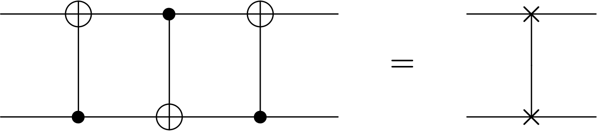

---
jupytext:
  text_representation:
    extension: .md
    format_name: myst
    format_version: 0.13
    jupytext_version: 1.15.2
kernelspec:
  display_name: Python 3 (ipykernel)
  language: python
  name: python3
---

+++ {"slideshow": {"slide_type": "slide"}}


<br>

<table width="100%">
<td style="font-size:400%px;font-style:italic;text-align:right;background-color:rgba(0, 160, 120,0.6)">
Elementos Básicos
</td></table>


$ \newcommand{\bra}[1]{\langle #1|} $
$ \newcommand{\ket}[1]{|#1\rangle} $
$ \newcommand{\braket}[2]{\langle #1|#2\rangle} $
$ \newcommand{\i}{{\color{blue} i}} $ 
$ \newcommand{\Hil}{{\mathbb H}} $
$ \newcommand{\cg}[1]{{\rm C}#1} $

```{code-cell} ipython3
---
slideshow:
  slide_type: slide
---
%run ../macro_CURSO.py
```


1. [Retroceso de fase](#retrofase)


2. [Circuitos Equivalentes](#circuitequiv)


3. [Operadores de Clifford](#opcliff)


4. [Computación Cuántica Universal](#compuniv)


4. [Medidas de calidad en circuitos](#medcalcirc)


5. [Complejidad computacional](#complejcirc)


7. [Preparación de un estado inicial](#prepainit)

+++

*Bibliografía:*

- Ronald de Wolf [Quantum Computing Lecture Notes](https://homepages.cwi.nl/~rdewolf/qcnotes.pdf) 

+++ {"slideshow": {"slide_type": "slide"}}

<a id="retrofase"></a>
<table width="100%">
    <td style="font-size:250%px;font-family:Helvetica;text-align:left;background-color:rgba(12, 43, 337, 0.3);">
<b>Retroceso de Fase</b>
</table>

+++ {"slideshow": {"slide_type": "slide"}}

Hemos estudiado ya el operador controlado $\cg{U}$. Es un error frecuente pensar que el cúbit controlador no se modifica.


+++ {"slideshow": {"slide_type": "fragment"}}

Un caso importante ocurre cuando el operador $U$ actúa sobre uno de sus autoestados 
(recuerda que los autovalores de  un operador unitario son fases puras)

<br>
$$
U\ket{u} = e^{i\lambda} \ket{u}
$$
<br>

+++ {"slideshow": {"slide_type": "fragment"}}

 Supongamos que por el *cúbit controlador* circula una superposición $(a\ket{0}+b\ket{1})$ y un autoestado $\ket{u}$ de $U$ por el cúbit controlado. La acción de $\cg{U}$ es
<br>
<br>

$$
\cg{U}: (a\ket{0} + b\ket{1})\otimes \ket{u} ~\to ~ a\ket{0}\ket{u} + b \ket{1}e^{i\lambda}\ket{u}  = \left( a\ket{0}\ket{u} + be^{i\lambda} \ket{1} \rule{0mm}{4mm} \right)\otimes \ket{u}
$$
<br>

+++ {"slideshow": {"slide_type": "fragment"}}

En resultado final es que la fase $e^{i\lambda}$ ha **modificado** el estado de entrada, mientras que el segundo cúbit no ha cambiado. 

+++ {"slideshow": {"slide_type": "slide"}}

El punto es que, en el segundo paso, la fase generada por la acción de U *no pertenece* realmente a ninguno de los dos espacios sino al producto. 

De modo que puede adscribirse al primer espacio, como hemos hecho en el último paso. 

De ahí el nombre de *retroceso de fase*, en inglés "phase kickback". 

+++ {"slideshow": {"slide_type": "fragment"}}

El siguiente circuito resume la acción de retroceso de fase

<br>
<div>

</div>
<br>

+++

<div class="alert alert-block alert-success">

<b>Ejercicio 1.3.1.1 </b> 
    
programa un circuito en el que  $U = P(\phi)$ es el operador de fase y el estado en el primer cúbit es $\ket{0}$ y en el segundo es $\ket{1}$. 
    
    
- Usando el *statevector_simulator* representa el estado de salida para distintos de valores de $\phi\in $ 
    
- ¿en qué plano rota el vector del primer cúbit? ¿Cómo podemos cambiar dicho plano de rotación?
</div>

+++ {"slideshow": {"slide_type": "slide"}}

<a id="circuitequiv"></a>
<table width="100%">
<td style="font-size:250%px;font-family:Helvetica;text-align:left;background-color:rgba(12, 43, 337, 0.3);">
<b>Circuitos Equivalentes</b>
</table>

+++ {"slideshow": {"slide_type": "slide"}}


Es posible encontrar distintos circuitos que producen acciones idénticas sobre un estado arbitrario. Se denominan *circuitos equivalentes*. 

Matemáticamente, representan distintas descomposiciones del mismo operador unitario en unitarios

+++ {"slideshow": {"slide_type": "fragment"}}

### Conjugación


Una caso muy frecuente es la **conjugación** de una puerta $V$  por un **unitario** $U$


$$
U V   U^\dagger = V'  
$$

El operador conjugado $V'$ tiene **la misma acción** sobre la base *base rotada* $\{\ket{e'} = U\ket{e}\}$
que la que tiene $V$ sobre la original $\{\ket{e}\}$.

+++ {"slideshow": {"slide_type": "fragment"}}

 Por ello, 
 - los *autovalores* de $V$ y de $V'$ son los *mismos* y 
 
 - los *autovectores* son los *rotados*

$$
\lambda' = \lambda ~~~~~~\hbox{y}~~~~~~  \ket{\lambda}' = U\ket{\lambda}
$$

+++ {"slideshow": {"slide_type": "fragment"}}

Comprobémoslo

$$
\fbox{$V \ket{\lambda}= \lambda\ket{\lambda}$} ~~\Rightarrow ~~~V'\ket{\lambda}' = (UVU^\dagger) U\ket{\lambda} = UV\ket{\lambda} =  U(\lambda\ket{\lambda}) = \lambda U\ket{\lambda} = \lambda\ket{\lambda}' ~~\Rightarrow ~~~ \fbox{$ V' \ket{\lambda}' = \lambda\ket{\lambda}'$}
$$
<br>

+++ {"slideshow": {"slide_type": "slide"}}

Por ejemplo 
<br>
<br>
<div>

</div>
<br>
<br>
y,  equivalentemente, intercambiando $X \leftrightarrow Z$. 

+++ {"slideshow": {"slide_type": "fragment"}}

<br>

- Este tipo de equivalencia se sigue de las identidades algebráicas
<br>
<br>
\begin{eqnarray}
HXH = Z ~~~~~&&~~ ~~~
HZH = X \nonumber
\end{eqnarray}
<br>
que son fáciles de visualizar recordando que  $H$ es una rotación de 180$^\circ$ en torno al eje diagonal en el plano $XZ$


+++ {"slideshow": {"slide_type": "fragment"}}

<br>

- Análogamente
<br>
<br>
\begin{eqnarray}
S X S^\dagger  = Y~~~~~&&~~~ ~~~
S Y S^\dagger = -X  ~~~~~~~~ S Z S^\dagger = Z\nonumber\\
\end{eqnarray}
<br>
también  son fáciles de visualizar recordando que 
 $S=\sqrt{Z}$ es una rotación de $90^\circ$ en torno al eje $Z$.

+++ {"slideshow": {"slide_type": "slide"}}

### Conjugación de una exponencial

muchas puertas unitarias son de la forma $V = e^{\alpha A}$

+++ {"slideshow": {"slide_type": "fragment"}}

Por ejemplo, si  $A = \hat{\bf n}\cdot \boldsymbol{\sigma} $ entonces $  ~\Rightarrow ~V= R_{\hat{\bf n}}(\theta)$ es el operador que rota un ángulo $\theta$ en torno al vector $\hat{\bf n}$ en la esfera de Bloch.

$$
 R_{\hat{\bf n}}(\theta) = e^{-i\frac{\theta}{2}\hat{\bf n}\cdot \boldsymbol{\sigma}}
$$


+++ {"slideshow": {"slide_type": "fragment"}}

<table width="100%"><td style="font-size:130%px;font-style:roman;text-align:left;">
 <br>
 <b>Lema</b>:
La conjugación de una exponencial se exponencia
<br><br>
</table>

\begin{eqnarray}
U e^{\alpha A} U^\dagger &=&  U \left(1 + \alpha A  + \frac{1}{2} \alpha^2 A^2 + ... \right) U^\dagger \\ \rule{0mm}{8mm}
&=& 1 + \alpha UAU^\dagger + \frac{1}{2}\alpha^2 UAU^\dagger U AU^\dagger + ... \\ \rule{0mm}{8mm}
&=& e^{ \alpha UAU^\dagger} 
\end{eqnarray}


+++ {"slideshow": {"slide_type": "slide"}}

Para el caso $A = \hat{\bf n}\cdot \boldsymbol{\sigma} $  la conjugación es
<br><br>
$$
U A U^\dagger ~\to ~U (\hat{\bf n}\cdot \boldsymbol{\sigma} ) U^\dagger = (U\hat{\bf n})\cdot  \boldsymbol{\sigma}
$$
<br>

+++ {"slideshow": {"slide_type": "fragment"}}

<table width="100%"><td style="font-size:120%px;font-style:roman;text-align:left;">
 <br>
<b>Corolario:</b>
  $~$ <i>la conjugación de una rotación en torno a un eje produce una rotación en torno al eje conjugado</i>
<br><br>
$$
U R_{\hat{\bf n}}(\theta) U^\dagger = R_{U\hat{\bf n}}(\theta)
$$
<br>
</table>

+++ {"slideshow": {"slide_type": "fragment"}}

Por ejemplo:

\begin{eqnarray}
H R_z(\theta) H &=& e^{-i \theta/2 HZH} =  e^{-i (\theta/2) X}. \\ \rule{0mm}{8mm}
&=& R_x(\theta)
\end{eqnarray}

<br>
<br>
<div>

</div>
<br>


+++ {"slideshow": {"slide_type": "slide"}}

### 2 cúbits

+++ {"slideshow": {"slide_type": "fragment"}}


 $\bullet$ La puerta  controlada $\cg{Z} =  {\rm diag}(1,1,1,-1)$   es simétrica ya que lo único que hace, es cambiar de signo al estado $\ket{11}$. Es decir
<br>
<br>
<div>

</div>
<br>

 En realidad, $\cg{Z}$ es un caso particular de   $\cg{P(\phi)} = {\rm diag} (1,1,1, e^{i\phi})$, para la cual la equivalencia es la misma. 

+++ {"slideshow": {"slide_type": "fragment"}}

$\bullet$   Otra equivalencia importante es
<br>
<br>

<div>

</div>
<br>

+++ {"slideshow": {"slide_type": "fragment"}}

Para probarla, observemos que las tres puertas del segundo cúbit se pueden componer para dar $HXH=Z$. Por el contrario, las dos puertas de Hadamard en el primer cúbit no se pueden multiplicar al haber un control entre ellas. 
Sin embargo, usando la  equivalencia anterior podemos invertir la puerta $\cg{Z}$ y, finalmente, conjugar en el primer cúbit $HZH=X$.

+++ {"slideshow": {"slide_type": "slide"}}


- Otra  equivalencia nada intuitiva pero muy importante relaciona tres operaciones CNOT con la permutación U$_{\rm SWAP}$


<br>
<br>
<div>

</div>
<br>
<br>

No hay una forma sencilla de probar esta identidad, así que lo recomendable es escribir las matrices asociadas a cada miembro y comprobar que son iguales

+++ {"slideshow": {"slide_type": "fragment"}}

 

 $\bullet$  La puerta de phase global controlada, $\cg{K_\phi} = {\rm diag} (1,1,e^{i\phi}, e^{i\phi})$, secretamente, no es una puerta controlada


<br>
<br>
<div>

</div>
<br>
<br>

+++ {"slideshow": {"slide_type": "slide"}}

También podemos comprobar la veracidad de las anteriores identidades programando los circuitos de ambos miembros

```{code-cell} ipython3
---
slideshow:
  slide_type: fragment
---
from qiskit import *
from qiskit.quantum_info import Statevector
U_simulator = Aer.get_backend('unitary_simulator')

qc_left= QuantumCircuit(2)
qc_right= QuantumCircuit(2)

qc_left.cx(0,1)
qc_left.cx(1,0)
qc_left.cx(0,1)
qc_right.swap(1,0)
 
print(qc_left)
print(qc_right)

U_left = execute(qc_left, backend = U_simulator).result().get_unitary()
U_right = execute(qc_right, backend = U_simulator).result().get_unitary()
```

+++ {"slideshow": {"slide_type": "fragment"}}

podemos comprobar que las matrices que representan los circuitos coinciden

```{code-cell} ipython3
---
slideshow:
  slide_type: fragment
---
from qiskit.tools.visualization import array_to_latex
array_to_latex(U_left, prefix="\\text{U_left = }\n")
```

```{code-cell} ipython3
---
slideshow:
  slide_type: '-'
---
array_to_latex(U_right, prefix="\\text{U_right = }\n")
```

+++ {"slideshow": {"slide_type": "slide"}}

<div class="alert alert-block alert-success">
    <b>Ejercicio 1.3.1.2</b> 
<br> 
$~$ Demuestra las equivalencia de circuitos anteriores de dos formas:
<br>
$~~~$ - sobre el papel,  multiplicando las matrices asociadas
<br>
$~~~$ - en qiskit, componiendo los circuitos y extrayendo el operador unitario asociado
</div>

+++ {"slideshow": {"slide_type": "fragment"}}

<div class="alert alert-block alert-success">
    <b>Ejercicio 1.3.1.3</b> 
 
    
comprueba la equivalencia de los dos circuitos siguientes, siempre que se verifique que $V^2 = U$

<br>
<br>
<div>

</div>
<br>
<br>

    
</div>

+++ {"slideshow": {"slide_type": "slide"}}

<a id="opcliff"></a>
<table width="100%">
    <td style="font-size:250%px;font-family:Helvetica;text-align:left;background-color:rgba(12, 43, 337, 0.3);">
<b>Operadores de Clifford</b>
</table>

+++ {"slideshow": {"slide_type": "slide"}}


<div class="alert alert-block alert-info">
<p style="text-align: center;"> <p style="text-align: left ;color: navy;">  
<b>Definición:</b> se define un <i>operador de Clifford</i>, $U$ como aquel que conjuga un operador de Pauli a otro operador de Pauli.
</p></div>

Los propios operadores de Pauli son operadores de Clifford.  La conjugación correspondiente simplemente refleja el operador de Pauli. Por ejemplo con $U=Z$

$$
ZXZ = -X~~~~~~~~~ZYZ = -Y ~~~~~~~~~ZZZ = Z 
$$


Pero vemos que también $H$ y $S$ son de Clifford. 
Por el contrario $T$ no es un operador de Clifford.

+++ {"slideshow": {"slide_type": "fragment"}}

<br>
<br>
<div class="alert alert-block alert-danger">
<b>Notar:</b> 
La forma más fácil de calcular estas conjugaciones es  recordar el álgebra de operadores de Pauli

$$
X Y = i Z ~~~~~ Y Z = i X ~~~~~ ZX = iY
$$
donde todas involucran a $X,Y$ y $Z$ en orden cíclico.

También el hecho de que dos operadores de Pauli distintos anti-conmutan

$$
\{X,Y\} = XY + YX = 0
$$
e igualmente para $Y$ y $Z$
</p></div>

+++ {"slideshow": {"slide_type": "slide"}}

Esta definición se extiende a puertas multi-cúbits. Un operador de Clifford será aquel que conjuga una cadena de Pauli para dar otra cadena de Pauli. Por ejemplo

\begin{eqnarray}
(XXH) \, (YZX) \,  (XXH)^\dagger &=& XXH \otimes YZX \otimes XXH \\ \rule{0mm}{10mm}
&=& XYX \otimes  XZX \otimes HXH \\ \rule{0mm}{10mm}
&=& (-Y)\otimes (-Z) \otimes Z \\ \rule{0mm}{10mm} &=& YZZ
\end{eqnarray}

+++ {"slideshow": {"slide_type": "fragment"}}

También podemos conjugar operadores obtenidos por exponenciación

$$
(XXH) \, e^{aYZX} \,  (XXH)^\dagger =e^{a XXH \otimes XZX \otimes XXH} =  e^{a YZZ}
$$

+++ {"slideshow": {"slide_type": "slide"}}

Para 2 cúbits la *clase de Clifford* admite puertas controladas.

$$
\cg{X} \, (X\otimes I)\,  \cg{X} = X \otimes X
$$

que copia el operador $X$ en el segundo cúbit


+++ {"slideshow": {"slide_type": "fragment"}}

Esta identidad se puede demostrar gráficamente 
<br>
<br>
<br>
<div>

</div>
<br>
<br>

+++ {"slideshow": {"slide_type": "slide"}}

<a id="compuniv"></a>
<table width="100%">
    <td style="font-size:250%px;font-family:Helvetica;text-align:left;background-color:rgba(12, 43, 337, 0.3);">
<b>Computación Cuántica Universal</b>
</table>

+++ {"slideshow": {"slide_type": "slide"}}

El objetivo de un *computador cuántico universal* es el de ser capaz de implementar el operador unitario más general

$$
U  = \sum_x \ket{f(x)}\bra{x}
$$
donde $f: x \to f(x)$ es una función arbitraria invertible.

+++ {"slideshow": {"slide_type": "fragment"}}

<div class="alert alert-block alert-info">
<p style="text-align: center;"> <p style="text-align: left ;color: navy;">  
<b>Teorema</b> <i>(Barenco et. al. 1995):</i> 
<br>
cualquier operador unitario $U_n$ sobre $n$ cúbits puede expresarse como el producto de 
<br>
<br>   
-  puertas continuas de <i>un cubit</i> 
<br>  
<br>
-  puertas CNOT.
</p></div>

+++ {"slideshow": {"slide_type": "fragment"}}

<br>
<br>
Un ejemplo de este teorema lo ofrece la siguiente descomposición de la puerta controlada $U = \cg{P_\phi}$
<br>
<br>
<div>

</div>
<br>


+++ {"slideshow": {"slide_type": "slide"}}

**Prueba**: consta de varios pasos


+++ {"slideshow": {"slide_type": "fragment"}}

1.  cualquier operador $U_n$ sobre $n$ cúbits se puede descomponer como *producto de operadores* $\cg{^kU}$ controlados por $k$ cúbits

+++ {"slideshow": {"slide_type": "fragment"}}

2. los operadores $\hbox{C}^kU$ se pueden descomponer como productos de un  operador $\cg{U}$ y puertas de Toffoli CCNOT

+++ {"slideshow": {"slide_type": "fragment"}}

En general para $\cg{^kU}$ necesitamos $k-1$ ancillas

<br>
<br>
<div>

</div>
<br>

+++ {"slideshow": {"slide_type": "slide"}}

<a id="Toffolidecomposition"></a>
3. Las puertas de Toffoli puede descomponerse como productos de $H$, $\cg{X}$ y $\cg{S}$

<br>
<br>
<div>

</div>
<br>
<br>
Este no es más que el caso particular  de la descomposición general de $\cg{^2U}$ usando $U = X = HZH=HSSH =  (HSH)(HSH)= V^2 ~~\Rightarrow ~~V = HSH$.

+++ {"slideshow": {"slide_type": "fragment"}}

<a id="CUdecomposition"></a>
4. Una puerta $\cg{U}$ puede descomponerse de forma única usando tres rotaciones $A, B$ y $C$ que verifiquen

$$
ABC = I ~~~~~,~~~~ e^{i\delta}  AXBXC = U
$$

<br>
<div>

</div>
<br>


En efecto, si el cúbit de control es $\ket{0}$ la fase $P(\delta)$ no le afecta y el operador efectivo en el segundo cúbit es $ABC= I$.

Por el contrario, si el primer cúbits es $\ket{1}$, entonces se aplica $AXBXC$ al segundo cúbit, y 
el operador $P(\delta)$ añade la fase global, que al ser global podemos pasársela al segundo cúbit, lo que hace $e^{i\delta} AXBXC = U$

+++ {"slideshow": {"slide_type": "fragment"}}

<details>

Las dos condiciones  algebráicas admiten una solución única para un operador unitario genérico
   
$$
U = e^{i\delta}\begin{bmatrix}\displaystyle e^{-i(\alpha+\beta)/2}\cos\frac{\theta}{2} & \displaystyle - e^{i(-\alpha+\beta)/2}\sin\frac{\theta}{2}  \\  
\rule{0mm}{5mm}
\displaystyle   e^{i(\alpha-\beta)/2}\sin\frac{\theta}{2}  &\displaystyle e^{i(\alpha+\beta)/2}\cos\frac{\theta}{2}
\end{bmatrix} = e^{i\delta} AXBXC ~  \Longrightarrow ~
\left\{ \begin{array}{l} A = R_z(\alpha) R_y\left(\frac{\theta}{2}\right) \\ B = R_y\left(-\frac{\theta}{2}\right) R_z\left(-\frac{\alpha + \beta}{2}\right) \\
C = R_z\left( \frac{\beta-\alpha}{2}\right)\end{array}
\right.
$$

<i> Nota: </i>: $U\in U(2)$  es un operador unitario y  su determinante es una fase $\det U = e^{i\delta}$.     Por su parte $\det(AXBXC) = 1$, y por tanto es un elemento de $SU(2)$.  Por esta razón es necesario añadir la fase $e^{i\delta}$ para obtener un operador unitario general. 
    
    
</details>    


+++ {"slideshow": {"slide_type": "slide"}}

### Puertas universales


- La descomposición del teorema de Barenco es  una identidad exacta capaz de descomponer un conjunto infinito y continuo de operadores $U_n$ en puertas CNOT y puertas *continuas* $U$ 


+++ {"slideshow": {"slide_type": "fragment"}}

- La computación cuántica *resistentes a errores ("fault tolerant")* demanda la **discretización** del proceso de computación.


+++ {"slideshow": {"slide_type": "fragment"}}


- Existe un *conjunto discreto de puertas universales* susceptibles de ser programadas de manera resistente a errores 


+++ {"slideshow": {"slide_type": "fragment"}}

 Puede ser diferente dependiendo de la plataforma utilizada. 

- En circuitos superconductores 

\begin{eqnarray}
\hbox{Shor basis}~~
 ~&:& ~~ \{ H, T, \hbox{CNOT}\}  \nonumber \\ \rule{0mm}{5mm}
\hbox{NCT}~ ~&:& ~~ \{ X,\hbox{CNOT}, \hbox{Toffoli}\}   \nonumber
\end{eqnarray}

+++ {"slideshow": {"slide_type": "slide"}}

- Es importante relacionar las puertas universales con *puertas nativas*

Por ejemplo, en ordenadores de iones atrapados hay las siguientes [puertas nativas](https://ionq.com/docs/getting-started-with-native-gates#introducing-the-native-gates)

$$
\{ \hbox{GPi},\hbox{Virtual}Z, \hbox{MS}\} 
$$

<br>
<br>
donde 
$$
\hbox{GPi} = \begin{bmatrix} 0 & e^{-i\phi} \\e^{i\phi} & 0 \end{bmatrix}~~~,~~~
\hbox{Virtual}Z = \begin{bmatrix} e^{-i\phi} & 0 \\ 0 & e^{i\phi} \end{bmatrix} ~~,~~~~
$$

y la puerta de Mølmer-Sørensen

$$
MS(\phi_1,\phi_2) = \frac{1}{\sqrt{2}}
\begin{bmatrix}
1 & 0 & 0 & e^{-i(\phi_1+\phi_2)} \\ 0 & 1 &-i e^{-i(\phi_1-\phi_2)} & 0 \\ 0 & -i e^{i(\phi_1-\phi_2)} & 1 & 0  \\ 
-ie^{i(\phi_1+\phi_2)} & 0 & 0 & 1 
\end{bmatrix}
$$


+++ {"slideshow": {"slide_type": "slide"}}

<div class="alert alert-block alert-info">
<p style="text-align: center;"> <p style="text-align: left ;color: navy;">  
<b>Teorema</b> <i>(Solovay Kitaev et. al. 1995):</i>   
<br>    
una puerta simple $U$ arbitraria puede ser aproximada con precisión $\epsilon$ usando una secuencia de puertas discretas 
$R$ en el siguiente sentido de proximidad
<br>
<br>
$$
\hbox{max}_{\ket{\psi}} || (U - R)\ket{\psi} ||<\epsilon
$$
<br>    
donde la secuencia aproximante $R$ involucra   $\leq {\cal O}(\log^2(1/\epsilon))$ puertas de un conjunto discreto universal, 
</p></div>

Referencia: M.A. Nielsen y L.I. Chuang *Quantum Computation and Quantum Information*, pág. 197.

+++ {"slideshow": {"slide_type": "slide"}}

<a id="medcalcirc"></a>
<table width="100%">
    <td style="font-size:250%px;font-family:Helvetica;text-align:left;background-color:rgba(12, 43, 337, 0.3);">
<b>Medidas de calidad en circuitos</b>
</table>

+++ {"slideshow": {"slide_type": "slide"}}

Alguna medidas cuantitativas  permiten comparar la calidad de distintos circuitos que efectúan la misma tarea. 

- **anchura**= es el número total de cúbits  que necesita.   

 El uso de ancillas incrementa la anchura de un circuito, y por tanto, reduce su calidad en comparación con otro circuito que tenga menor anchura. 

+++ {"slideshow": {"slide_type": "fragment"}}

- **coste**= el número de puertas presentes en el mismo. 

+++ {"slideshow": {"slide_type": "fragment"}}

- **complejidad**= es una medida estandarizada asociada al número de *puertas elementales* en las que puede descomponerse un circuito. 

 Es un número a reducir. Sin embargo no es una medida inambigua ya que depende de la librería utilizada. Por ejemplo, si ésta es la NCT, entonces el coste del [circuito](#Toffolidecomposition) es 1. Sin embargo, si la librería es la tomada por $ \{ H, S, T, \hbox{CNOT}\} $
entonces el coste sube hasta 7. Por ello, a la hora de comparar circuitos es importante definirlos en la misma base. 


+++ {"slideshow": {"slide_type": "fragment"}}


 
 * **profundidad**= para evaluar la *profundidad*  es necesario agrupar todas las puertas  que se puedan realizar en paralelo en cortes temporales de duración $\Delta$ (pulso).
 
 En particular puertas que actúen sobre registros diferentes no interferirán y se podrán paralelizar. 
 Por ejemplo, el [circuito que descompone $U$](#CUdecomposition)   tiene un coste igual a 6, pero una profundidad igual a 5. 
 


```{code-cell} ipython3
---
run_control:
  marked: false
slideshow:
  slide_type: slide
---
from qiskit import QuantumCircuit, transpile, Aer, QuantumRegister
qc = QuantumCircuit(3)


qc.h(0)
qc.swap(2,1)
qc.h(2)
qc.cx(2,0)
qc.h([0,2])
qc.draw('mpl')
```

```{code-cell} ipython3
print('tamaño=',qc.size())
print('puertas no locales=', qc.num_nonlocal_gates())
print('anchura=', qc.num_qubits)
print('profundidad=', qc.depth())
```

```{code-cell} ipython3
---
run_control:
  marked: false
slideshow:
  slide_type: slide
---
qc_dec=qc.decompose()
qc_dec.draw('mpl')
```

```{code-cell} ipython3
print('complejidad=', qc_dec.size())
print('puertas no locales=', qc_dec.num_nonlocal_gates())
print('anchura=', qc_dec.num_qubits)
print('profundidad=', qc_dec.depth())
```

```{code-cell} ipython3
---
slideshow:
  slide_type: slide
---
from qiskit import IBMQ
IBMQ.load_account()
provider = IBMQ.get_provider(hub='ibm-q')
provider.backends()
```

```{code-cell} ipython3
---
slideshow:
  slide_type: slide
---
backend = provider.get_backend("ibmq_lima")
backend.configuration().basis_gates
```

```{code-cell} ipython3
---
slideshow:
  slide_type: fragment
---
#qc_trans = transpile(qc_dec)
qc_trans = transpile(qc,backend)
qc_trans.draw('mpl')
```

```{code-cell} ipython3
---
slideshow:
  slide_type: fragment
---
print('complejidad=', qc_trans.size())
print('puertas no locales=', qc_trans.num_nonlocal_gates())
print('anchura=', qc_trans.num_qubits)
print('profundidad=', qc_trans.depth())
```

+++ {"slideshow": {"slide_type": "slide"}}

<div class="alert alert-block alert-success">
<b>Ejercicio 1.3.1.4</b> 


1: Programa y ejecuta un circuito de 16 cúbits que prepare el estado $\ket{00\ldots 0} \to \frac{1}{\sqrt{2}}\left(\ket{00\ldots 0} + \ket{11\ldots 1}\right) $ 

2: Modifica la posición de los controladores hasta reducir la profundidad a 5.

</div>

+++ {"slideshow": {"slide_type": "slide"}}

<a id="eficcirc"></a>
<table width="100%">
    <td style="font-size:250%px;font-family:Helvetica;text-align:left;background-color:rgba(12, 43, 337, 0.3);">
<b>Complejidad computacional</b>
</table>

+++ {"slideshow": {"slide_type": "slide"}}

Un algoritmo es una descomposición de una función en composición de un conjunto de *funciones primitivas*

+++ {"slideshow": {"slide_type": "fragment"}}

A la hora de comparar estrategias de computación es necesario  analizar el coste relativo de diferentes algoritmos. Esta es la labor de teoría de la complejidad computacional. 

+++ {"slideshow": {"slide_type": "fragment"}}

Como regla general, cada *modelo computacional* reducirá un problema complejo a una serie de pasos elementales (*operaciones primitivas*), a los que les asignaremos un coste computacional 1. 

+++ {"slideshow": {"slide_type": "fragment"}}

La teoría de la *complejidad computacional* agrupa problemas por clases en las que el uso de recursos computacionales (tiempo o espacio) crece de forma similar. 

+++ {"slideshow": {"slide_type": "slide"}}

## Complejidad clásica:
<br>


 -  **P** ( *Polinómica*):  decimos que un problema pertenece a esta clase si puede ser resuelto en un tiempo ($t \sim $número de pasos) polinómico en el tamaño $n$ del dato de entrada $t\sim \exists k \Rightarrow  {\cal O}(n^k)\, $. 

+++ {"slideshow": {"slide_type": "fragment"}}

- **BPP** ("*Bounded probabilistic polynomial*"): problemas que se pueden resolver mediante una máquina de Turing probabilística en tiempo polinómico y con una probabilidad de error $\leq 1/3$ para cualquier dato de entrada. 

+++ {"slideshow": {"slide_type": "fragment"}}

- **NP** ("*No determinista Polinómica*"): clase de problemas que pueden ser  *verificados* en tiempo polinómico,
pero carecen de un algoritmo para ser resueltos en tiempo polinómico. 


Es evidente que **P**$\subseteq$ **NP**. No es evidente, aunque sí conjeturado, que **P**$\neq$ **NP**, siendo este un problema central en matemáticas. 


+++ {"slideshow": {"slide_type": "slide"}}


-  **NPC** (*NP-Completa*): es un subconjunto de **NPC**$\subset$**NP** que contiene a los problemas más difíciles en esta clase. 
<br>
<br>
 Un problema es **NPC** si cualquier  problema en **NP** puede aplicarse al mismo  mediante un algoritmo de coste polinómico. 


+++

La importancia de esta subclase es que la resolución eficiente de uno solo de sus elementos implica lo mismo para toda la clase, o lo que es igual implicaría que **NP** = **P**.

Ejemplos de esta clase son  el *problema del viajante* y  el de la *satisfabilidad booleana*.

+++ {"slideshow": {"slide_type": "fragment"}}

- **PSPACE**. Clase de problemas con necesidades de *memoria* exponencial en el tamaño del problema.

+++

<div class="alert alert-block alert-warning">
<b> Ejemplos:</b> 

-  ejemplos de la clase <b>NP</b>: la <i>factorización entera</i>, o la evaluación de  <i>logaritmos discretos</i>,... 
    
    
- ejemplos de la clase <b>NPC</b> son el <i>problema del viajante</i>, la <i>coloración de grafos</i>, 
</div>

+++ {"slideshow": {"slide_type": "slide"}}

## Complejidad cuántica:
<br>
<br>

Decimos que un circuito es *eficiente* (*no-eficiente*) si su *coste* escala de forma *polinómica* (*exponencial*)  con la anchura del circuito. 

+++ {"slideshow": {"slide_type": "fragment"}}

La descomposición de un operador unitario genérico $U(n)$ no será eficiente, puesto que viene especificado por un número exponencial $\sim 2^n\times 2^n$ de parámetros. 

+++

Al igual que en computación clásica existen clases de complejidad cuánticas asociadas a familias de problemas que escalan de la misma manera.

+++ {"slideshow": {"slide_type": "slide"}}


 - **BQP** (*Bounded Quantum Polynomial*): clase de problemas para los que existe un algoritmos cuántico de coste polinómico y con una probabilidad de error $\leq 3$. Es el análogo cuántico de la clase **BPP**. 

+++ {"slideshow": {"slide_type": "fragment"}}

 - **quantum NP**: clase de problemas que admiten un circuito polinómico en el número de cúbits que *verifica*  una eventual solución con probabilidad 1 si es correcta, y *rechaza* cualquier resultado que no sea solución con la misma probabilidad. 

+++ {"slideshow": {"slide_type": "fragment"}}

- **QMA** (*Quantum Merlin-Arthur*): admitiendo una probabilidad de error $\leq 1/3$ en la clase **quantum NP** obtenemos el análogo cuántico de la clase **NP**.  Existe una clase **QMA**-completa que contiene los problemas más duros en esta categoría. ´

+++

<div class="alert alert-block alert-warning">
<b> Ejemplos:</b> 
    
- El ejemplo más famoso de problema  <b>QMA</b>-completo es determinar si la energía $E_0$ del estado fundamental de un Hamiltoniano $k-$local es $E_0\leq a$ o bien $E_0\geq a + 1/poly(n)$.
</div>

+++

<div class="alert alert-block alert-danger">
<b> Notar:</b> 
    

La teoría de la complejidad computacional intenta establecer relaciones de inclusión entre estas clases. 
A parte de la mencionada <b> P $\subseteq$ NP </b> se  puede probar que

<p style="text-align:center;">   <b> P $\subseteq$ BPP $\subseteq$ BPQ $\subseteq$ PSPACE </b>    </p>
    
</div>

```{code-cell} ipython3

```
